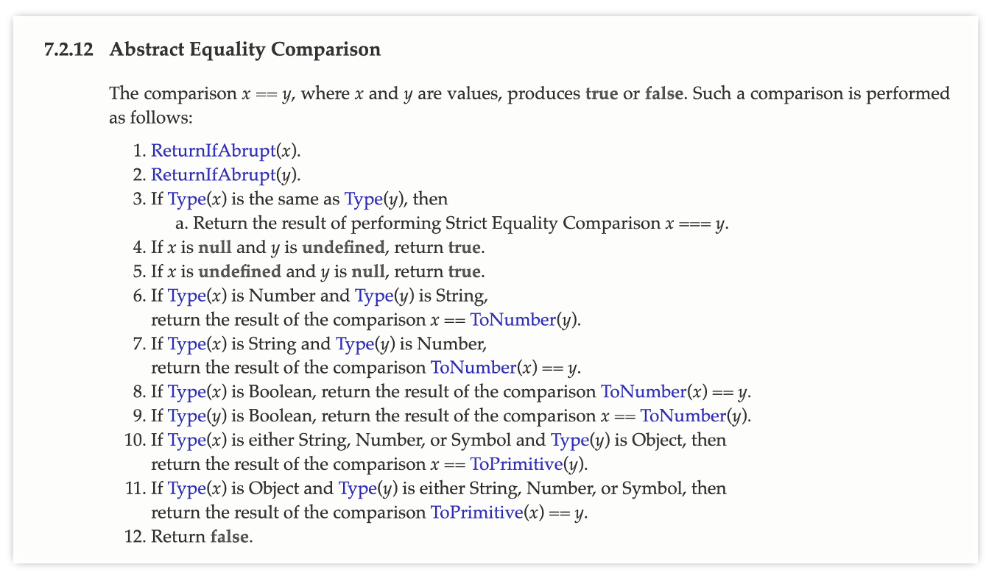
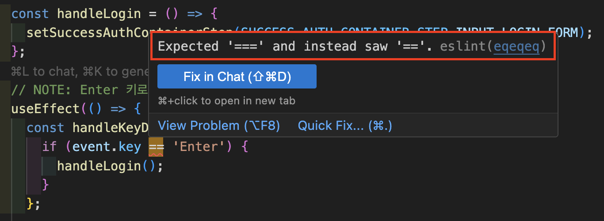

JavaScript에는 크게 2가지 타입 변환 방식이 존재한다.

1. 명시적 타입 변환(Type casting)
2. 암묵적 타입 변환(Type coercion)

<br />

**`명시적 타입 변환`**의 경우, 하단의 코드 예시와 같이 Global Object의 `Number`, `JSON.stringify` 함수 또는 메서드의 인자로 전달하는 개발자의 의도가 분명히 드러나는 방식이다.

```js
Number("123"); // 123
parseInt("123"); // 123
parseFloat("123.45"); // 123.45

String(123); // 123

JSON.stringify(123);
```

반면에 **`암묵적 타입 변환`**의 경우, 하단의 코드 예시와 같이 JavaScript 엔진이 **자동으로** 타입을 변환하는 방식이다. 연산 및 조건식 등에서 피연산자의 타입이 일치하지 않을 때 타입이 변환된다.

```js
"5" + 2; // "52"
"hello" + 123; // "hello123"
`value: ${123}`; // "value: 123"
5 == "5"; // true
```

이 중에서 오늘 살펴볼 부분은 `==`([loose equality](https://developer.mozilla.org/en-US/docs/Web/JavaScript/Reference/Operators/Equality){:target="\_blank"}) 비교 연산자 사용 시 수행될 수 있는 [Abstract Equality Comparison](https://262.ecma-international.org/6.0/#sec-abstract-equality-comparison){:target="\_blank"} 섹션이다.

{: width="95%"}

정리하면 하단의 순서대로 검사가 진행된다.

## Abstract Equality Comparison

`x == y`로 두 값 `x`와 `y`를 비교하면 `true`나 `false가` 나온다. 이때 다음의 순서로 비교가 진행된다.

1. `x` 또는 `y` 에러 발생 시 중단
2. `x`와 `y` 타입이 동일하면, [Strict Equality Comparison](https://262.ecma-international.org/6.0/#sec-strict-equality-comparison){:target="\_blank"} 수행
3. `x`가 `null`이고, `y`가 `undefined`이면, `true` 반환
4. `x`가 `undefined`이고, `y`가 `null`이면, `true` 반환
5. `x`가 `number` 타입이고, `y`가 `string` 타입이면, `x == ToNumber(y)` 비교
6. `x`가 `string` 타입이고, `y`가 `number` 타입이면, `ToNumber(x) == y` 비교
7. `x`가 `boolean` 타입이면, `ToNumber(x) == y` 비교
8. `y`가 `boolean` 타입이면, `x == ToNumber(y)` 비교
9. `x`가 (`string`/`number`/`symbol`) 타입이고, `y`가 `object`이면, `x == ToPrimitive(y)` 비교
10. `x`가 `object`이고, `y`가 (`string`/`number`/`symbol`) 타입이면, `ToPrimitive(x) == y` 비교
11. `false` 반환

<br />

위 규칙만 봤을 땐 생각보다 복잡한 변환 과정들이 일어나는 것 같진 않다. 하지만, 내부적으로 활용되는 [ToNumber](https://262.ecma-international.org/6.0/#sec-tonumber){:target="\_blank"}, [ToPrimitive](https://262.ecma-international.org/6.0/#sec-toprimitive){:target="\_blank"} 추상 연산자 규칙들까지 온전히 이해한 상태로 코드에서 활용하긴 어렵다. 가령 알고 있다 하더라도 나중에 기억이 휘발될 수 있고, 함께 협업하는 동료까지 해당 규칙들을 전부 알고 있을지 확신할 수 없다.

따라서 `===` 연산자를 `==`([loose equality](https://developer.mozilla.org/en-US/docs/Web/JavaScript/Reference/Operators/Equality){:target="\_blank"}) 대신해 많이 사용한다. 이는 조건식의 예측 가능성을 높여 인적 오류를 줄이기 위한 목적이 있다고 생각한다.

`===` 연산자가 동등성을 판단하는 과정에서 JavaScript 엔진은 두 피연산자의 데이터 타입이 상이할 때 `false` 데이터를 반환한다. 따라서 하단의 조건식들과 같이, 두 피연산자의 데이터 타입은 다르지만 `==` 연산자의 특징인 type coercion으로 인해 코드 작성자의 의도와 다르게 `true`로 평가되는 경우가 발생할 수 있다.

```js
123 == "123"; // true
123 === "123"; // false

"" == 0; // true
"" === 0; // false

null == undefined; // true
null === undefined; // false
```

위에서 `==` 비교 연산자 사용 시 수행될 수 있는 여러 검사 단계에 대해 소개했으니, 실제 코드로 여러 조건식의 결괏값을 예측해 보자(`T(=true), F(=false)`).

```js
5 == 5;
null == undefined;
"5" == 5;
true == 1;
"" == 0;

// T, T, T, T

[] == 0;
[1, 2, 3] == "1,2,3";
false == "0";
({}) == "[object Object]";
[5] == 5;

// T, T, T, T, T

[] == ![];
[] == "";
true == "1";
[1, 2] == "1,2";
({ valueOf: () => 10 }) == 10;

// T, T, T, T, T

null == 0;
undefined == 0;
NaN == NaN;
({ toString: () => "5" }) == 5;
Symbol("x") == Symbol("x");

// F, F, F, T, F

[0] == false;
[] == [];
({ valueOf: () => 1, toString: () => "2" }) == 1;
new Date(0) == 0;
[[[0]]] == 0;

// T, F, T, F, T
```

본문에서 소개하지 않은 [ToNumber](https://262.ecma-international.org/6.0/#sec-tonumber){:target="\_blank"}, [ToPrimitive](https://262.ecma-international.org/6.0/#sec-toprimitive){:target="\_blank"} 추상 연산자의 세부 규칙들을 이해하지 않는다면, Abstract Equality Comparison 규칙만으로는 위 문제의 모든 답을 도출하긴 어려울 것이다.

따라서 필자는 `==` 비교 연산자의 사용을 되도록 피하는 것이 좋다는 생각이다. 과도하게 추상화된 타입 변환 규칙으로 인해 코드의 가독성이 저해되기 때문이다.

## 권장 사항

실무에서는 다음과 같은 원칙을 따르는 것이 좋다.

### 1. `===` 비교 연산자 사용

타입 변환 없이 비교하므로, 비교적 결과의 예측 가능하고 안전하다.

```js
// ✅ 권장
if (value === null) { ... }
if (count === 0) { ... }
if (status === "active") { ... }

// ❌ 지양
if (value == null) { ... }
if (count == 0) { ... }
if (status == "active") { ... }
```

### 2. `null`과 `undefined` 동시 체크가 필요한 경우

`==` 비교 연산자의 사용이 유용한 경우 중 하나는 `null`과 `undefined`를 동시에 체크할 때이다. 하지만 이 경우에도 명시적으로 분리해 비교하는 것이 조건식의 의도를 더욱 명확히 나타낸다.

```js
// 간결하지만 의도가 불명확할 수 있음
if (value == null) { ... }

// 명시적 작성 (✅ 권장)
if (value === null || value === undefined) { ... }

// 또는 상황에 맞게 nullish coalescing 활용
const result = value ?? defaultValue;
```

### 3. ESLint 규칙 활용

프로젝트에 ESLint를 도입하여 `==` 비교 연산자의 사용을 자동으로 감지하고 방지할 수 있다.

```json
{
  "rules": {
    "eqeqeq": ["error", "always"]
  }
}
```

{: width="100%"}

<br />

## 📝 마치며

JavaScript의 타입 변환은 언어의 유연성을 제공하지만, 동시에 예상치 못한 버그의 원인이 될 수 있다.

명시적으로 타입을 변환하거나, `===` 비교 연산자를 사용하는 습관을 들이면, 더 안전하고 유지보수에 유리한 코드를 작성할 수 있을 것이다. 타입 변환의 동작 원리를 이해하는 것도 중요하지만, 이보단 **예측 가능한 코드를 작성하는 것**이 보다 중요하다. 복잡한 규칙에 의존하지 않고, 명시적이고 의도가 명확한 코드를 작성하는 것이 장기적으로 팀 전체의 생산성 향상에 도움이 될 것이다.
