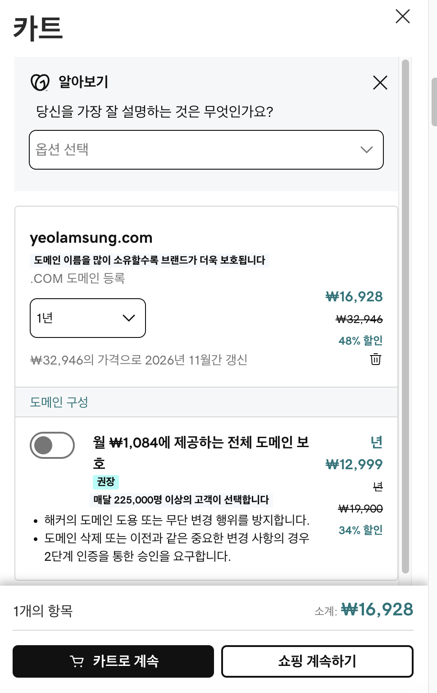
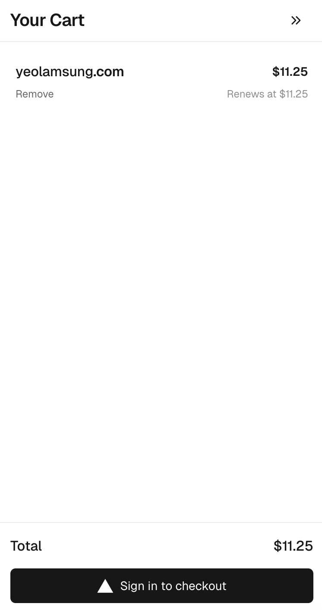
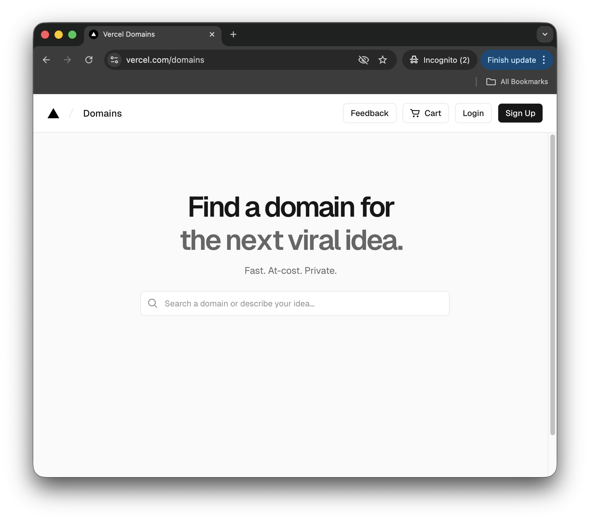
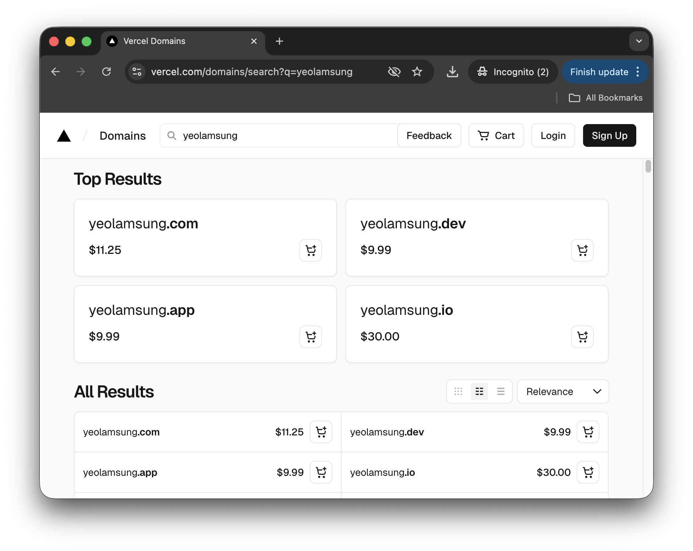
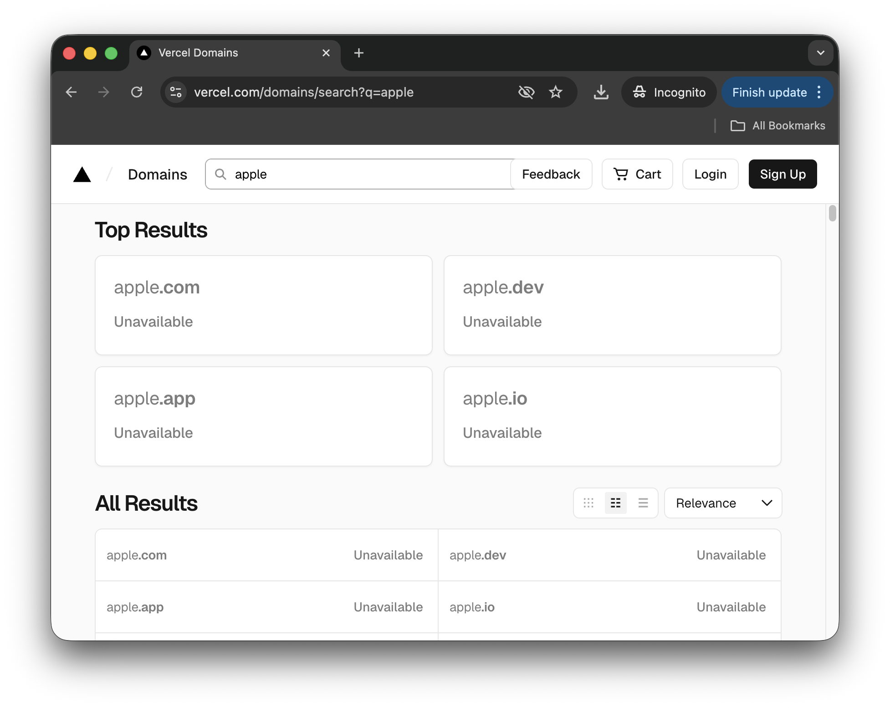
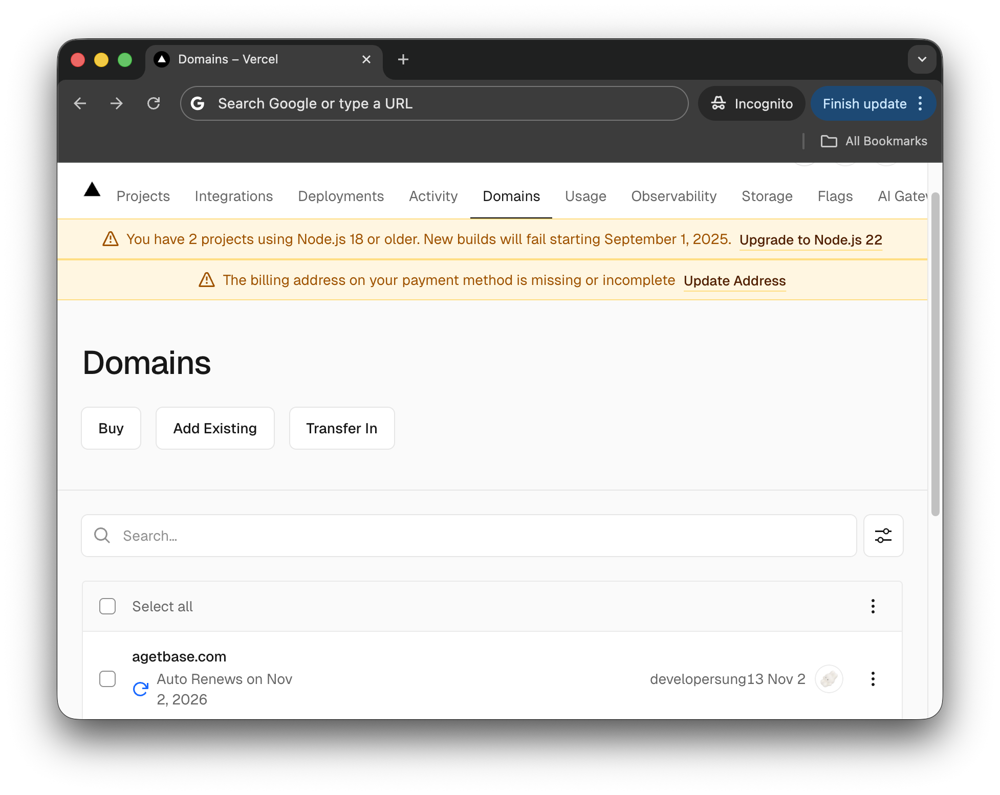
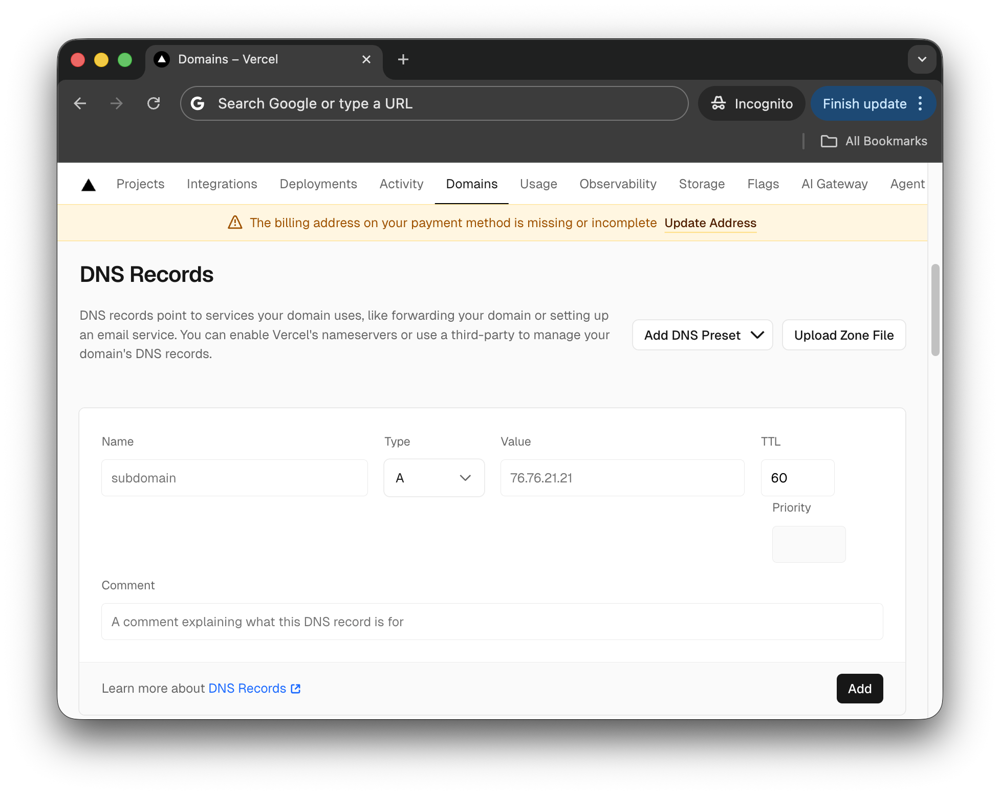
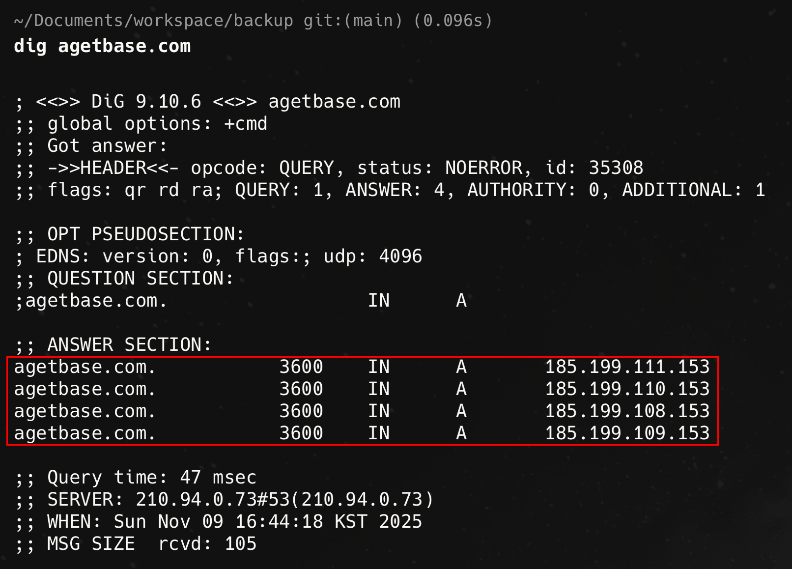
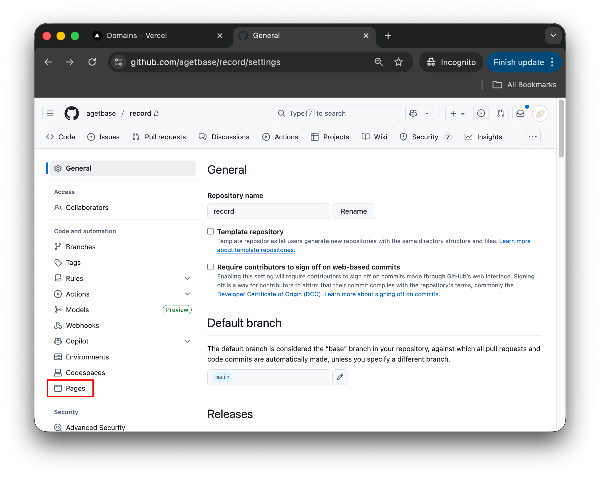
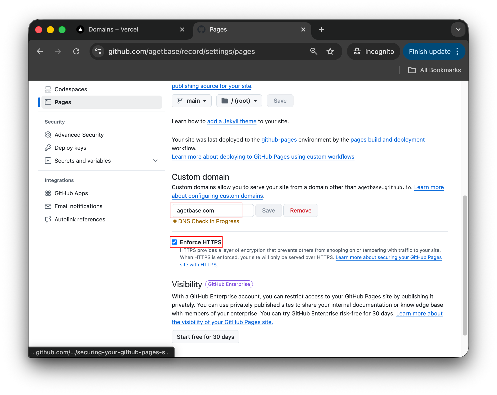

과거 GoDaddy에서 현재 Vercel을 사용하게 된 배경은 다음과 같다.

개인 도메인을 구매하기 위해선 보통 [GoDaddy](https://kr.godaddy.com/){:target="\_blank"} 사이트를 이용해 도메인을 구매한 후, CNAME을 설정한다. 하지만, 첫해 구매 할인을 제외하면, 사진과 같이 **33,000원**에 가까운 비용을 이듬해부터 청구하게 된다.

{: width="400"}

이에 반해, [Vercel](https://vercel.com/){:target="\_blank"}에서는 **$11.25** 약 527원 정도 저렴한 금액(`25.11.09 기준`)으로 동일 도메인을 구매할 수 있고, **이듬해에도 인상 없는 금액으로 갱신이 가능하다는 장점(매우 중요..⭐️)**이 있다.

{: width="400"}

이점이 마음에 들어, 기존에 사용하던 GoDaddy 도메인도 만료됐겠다, Vercel에서도 GitHub Pages 연결이 가능한지 궁금해져 글을 작성하기로 했다.

[https://vercel.com/domains](https://vercel.com/domains) 페이지에 접속하여 구매하려는 도메인을 직접 입력하거나, 어떤 목적의 도메인인지 설명을 통해 추천을 받을 수 있다.

{: width="600"}

{: width="600"}

위 이미지와 같이, 여러 TLD별로 도메인 구매가 가능한지 개별 확인할 수 있고, 이미 점유된 도메인은 당연히 구매할 수 없다.

{: width="600"}

Vercel에서 로그인을 완료하여 도메인 결제 프로세스를 마치면, 대시보드에서 `Domains` 메뉴에서 구매한 도메인이 추가된 것을 확인할 수 있다.

{: width="600"}

{: width="600"}

해당 도메인을 클릭하고, `DNS Records` 영역으로 이동해 다음의 DNS Record 5개를 등록한다.

|#|Name|Type|Value|TTL
|1| |A|185.199.108.153|3600|
|2| |A|185.199.109.153|3600|
|3| |A|185.199.110.153|3600|
|4| |A|185.199.111.153|3600|
|5|www|CNAME|레포명.github.io|3600|

> 출처 : [GitHub Docs](https://docs.github.com/en/pages/configuring-a-custom-domain-for-your-github-pages-site/managing-a-custom-domain-for-your-github-pages-site#configuring-an-apex-domain)

터미널 환경에서 `dig 도메인네임` 명령어를 입력하면, DNS Record가 정상적으로 등록됐는지 확인할 수 있다.

{: width="800"}

 

다음으로, Vercel 도메인과 연결할 GitHub Pages 대상 레포로 이동해 `Setting`→`Pages` 메뉴에 진입한다. `Custom domain` 입력란에 Vercel에서 구매한 도메인을 입력하고, 우측의 `Save` 버튼을 클릭한다. 그리고, 하단에 `Enforce HTTPS` 설정을 활성화한다.

{: width="800"}

{: width="800"}

 

위 과정을 마치면, 프로젝트의 루트 디렉토리에 `Custom domain` 입력란에 저장했던 도메인 정보가 저장된 `CNAME` 파일 생성 커밋이 추가될 것이다.

그 후, `DNS Check in Progress` 상태에서 일장 시간이 경과(`필자의 경우 30분`)하면, `Your site published at https://agetbase.com`과 같은 알림 표시가 `Pages` 메뉴 페이지에서 보이면, 성공적으로 연결되어 커스텀 도메인 주소로 GitHub Pages에 접근할 수 있다.

{: width="800"}
