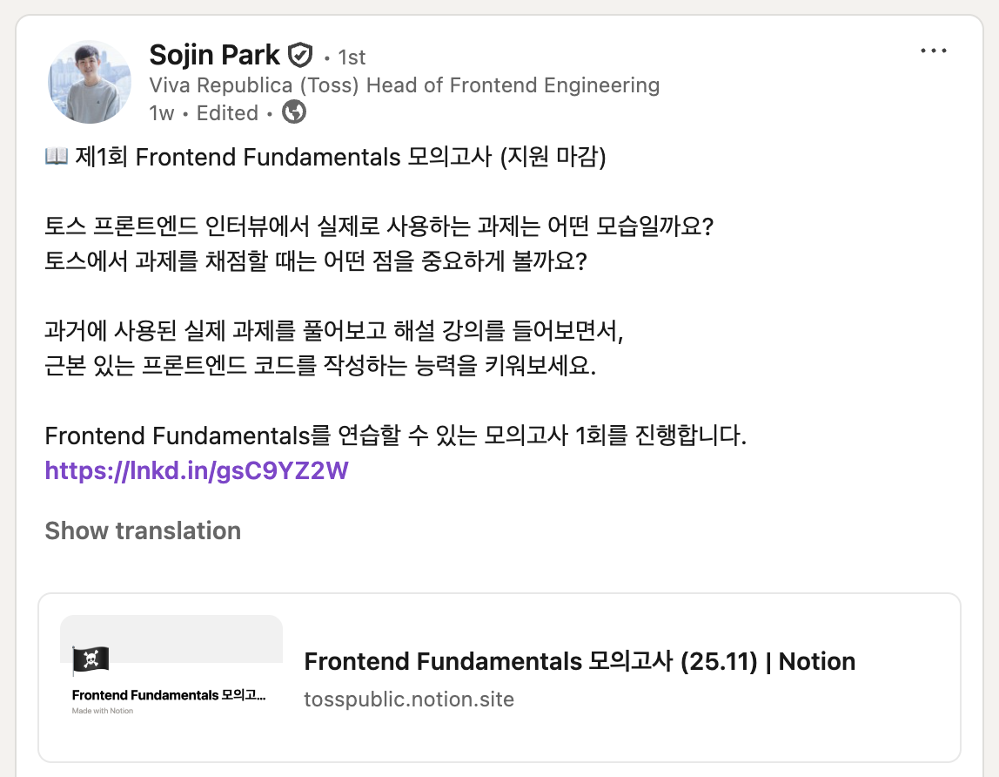

평소 기능 구현에 급급해 코드의 냄새를 고려하지 못한 형태의 작업물들을 많이 생산해 왔다.

세 살 버릇 여든까지 간다고, 이제라도 바로잡을 때가 온 것 같아, 올해 토스팀에서 공개했던 프론트엔드 코드 지침서 문서를([Frontend Fundamentals](https://frontend-fundamentals.com){:target="\_blank"}) 출퇴근 간에 읽고 있다.

현재를 기준으로 총 4가지의 주제(`코드퀄리티`, `번들링`, `접근성`, `디버깅`)가 존재하고, 프론트엔드 개발자라면 업무에서 종종 고민해 봤을 부분들을 포함하고 있다.

예를 들어, **Props Drilling**의 해소 방법과, UX/DX 개선을 위한 **접근성(A11y)** 개선 등.

<br />

{: width="550"}

최근 링크드인에서 [제1회 Frontend Fundamentals 모의고사](https://www.linkedin.com/posts/raon0211_frontend-fundamentals-%EB%AA%A8%EC%9D%98%EA%B3%A0%EC%82%AC-2511-notion-activity-7396381227236130816-m_r5?utm_source=share&utm_medium=member_desktop&rcm=ACoAAClF55oBe-8awkbfJiHgd04KxphIDPBv9Qs){:target="\_blank"} 포스트를 접하게 되었고, 공부를 했으면 시험은 봐야하지 않을까라는 생각과 호기심으로 신청을 통해 참여하게 되었다.

시험은 과거 채용 과제에 사용되었던 내용이며, 제출 기한은 시험 내용 공개일로부터 3일이라는 넉넉한 기간이 제공됐다.

시험 종료 후, GitHub Discussions에서는 다양한 토론들이 진행되었다. 폴더 구조(DDD/FSD)에 대한 고찰, `React.Suspense` 사용이 필요한지 등.

이에 대한, 다양한 참여자분들의 의견들을 보고 생각보다 비슷한 고민을 하고 있는 개발자가 많다는 것을 알게 되었다. 이 부분은 [재협 님](https://www.linkedin.com/in/jbee37142/)과, [종택 님](https://www.linkedin.com/in/jong-taek-oh-8b29901a7/?originalSubdomain=kr)께서 진행해 주신 모의고사 실시간 해설 강의를 통해 해소해 주셨다.

이번 시험에서 중요하게 고려해야 했던 부분은 세부 도메인에 대한 기능 구현의 집중보단 어떻게 해야, **직관적이고, 장기적으로 관리하기 좋은 코드를 설계할 수 있을지 고민하여 풀어내는** 것이었다.

<br />

필자에 기억에서 휘발되지 않고 각인된 부분은 크게 5가지가 있었다.

- 화면과 페이지 컴포넌트가 **되도록** 1:1 매칭 되도록 하기. (항상은 ❌)
- 추출(extraction)과, 추상화(abstraction)를 혼동하면 안 된다. (비즈니스 로직 덩어리를 단순히 파일로 분리한 것은 추출임)
- 폴더 구조는 FSD와 같은 개발 방법론을 무조건적으로 도입하기보단, 작업하는 컴포넌트와 가까운 위치에만 있으면 OK이다.
- 일반적으로 예상되는 형태의 코드를 작성하기. (hook의 반환 데이터 예측 가능성 향상)
- 미션이 주어졌을 땐 큰 그림을 대략적으로 정리한 후, 시작하자. 세부 구현은 그 다음 단계. (세부적인 기능 요구사항 구현에만 집중하면, 실질적으로 신경써야 할 부분들을 놓칠 수 있음 ⚠️)

<br />

이외에도 실제 코드 설계 단계에서 Best Practice가 될만한 유용한 방법들을 해설해 주신 내용에서도 다양한 인사이트를 얻어볼 수 있었다.

한 가지 예시로 위에서 언급했던 세 번째 포인트가 있다.

```tsx
export function TempComponent() {
    const [tempStates, setTempStates] = useTempStates();
    ...
}
```

훅의 반환 데이터는 예측이 어렵기 때문에 `React.useState`와 같이, 대부분의 이들이 일반적으로 기억하고 사용하는 형태로 훅을 구성하는 것이 좋다는 것이다. 창의력은 코드상에서 항상 모범이 되지만은 않는다는 것이 와 닿았다.

<br />

해설 이후 현재 스스로의 상태를 회고해 보니, GitHub 잔디와 함께 꾸준히 라플레시아를 곳곳에 심어둔 것 같아서 꽤나 어지럽다.

이것들이 가까운 미래에 레거시로 변모하여 다시 괴롭힐 것을 생각하면, 지금부터라도 이번 모의고사를 통해 얻었던 경험들을 업무에서 십분 활용해 볼 생각이다.

{: width="450"}

짧은 기간 동안, `Frontend Fundamentals` 문서 페이지에서 평소 정립했던 부분들을 이번 1차 모의고사에 적용하기 위해 고민하고, 온전히 몰입할 수 있었던 이 소중한 경험을 통해 더욱 성장해 보려고 한다.
