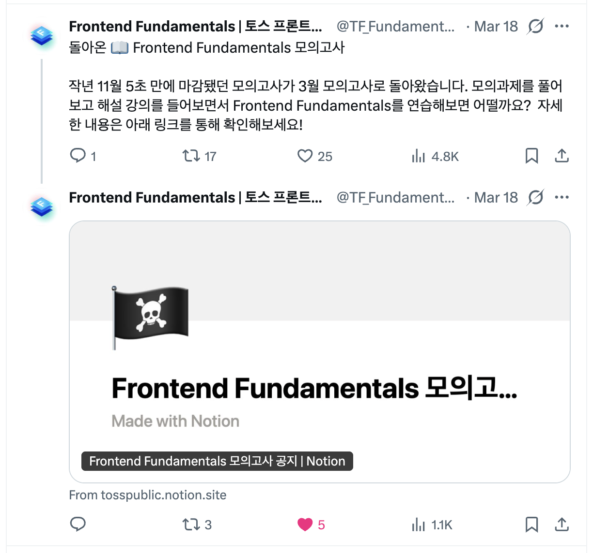

작년 11월에 이어 올해도 [Frontend Fundamentals 모의고사 2회](https://tosspublic.notion.site/frontend-fundamentals-mock-exam-notice){:target="\_blank"}가 진행되었다.

{: width="550"}

지난 회차 당시 해설 방송과, 익힘책이라는 보조 학습 자료를 통해 습관처럼 사용해 오던 비즈니스 로직에서 코드 스멜을 어떻게 제거할 수 있는지 배울 수 있었다.

## 👀 들어가며

이번 회차에서는 과제 문서에 기재된 요구사항에 따른 기능 구현이 아닌, 이미 완성된 코드를 기반으로 리팩토링하는 것이 주 목적이었다.

과제를 시작하기에 앞서 내가 생각하는 리팩토링에 대해 고찰해 보았다.

리팩토링은 외부 동작은 유지하며, 내부 구조를 개선하는 것이다. 함께 일하는 동료들이 코드 리뷰 및 유지보수가 쉽도록 기존의 코드를 예측할 수 있는 방식으로 변경하는 개선 작업.

조직마다 차이는 있겠지만, 이미 잘 사용해 오던 코드 베이스를 리팩토링하는 데 추가적인 작업 시간을 할당받긴 어려울 것이다. 리팩토링은 성능 최적화와 다르다. 그 때문에 사업적 성과를 내기 위해 힘써 주시는 PM/PO와 분들과, 회사로선 피처 개발보단 우선순위가 낮게 평가된다고 생각한다. 하지만, 제품을 개발하는 엔지니어들이라면 불과 1, 2년 전 스스로 작성했던 서비스 코드를 다시 보면 쉽게 이해가 되지 않고, 아쉬운 점이 느껴진다고 생각한다. 따라서 한 번쯤은 리팩토링의 필요성에 대해 느껴보았을 것이다.

리팩토링은 당장의 성과를 보여주기 위한 작업이 아니라, 앞으로 함께 일할 동료들과 미래에 나를 위한 작업이다. 논밭에는 작물과 함께 잡초도 자란다. 이 잡초들을 뽑지 않으면, 작물이 흡수해야 할 양분을 빼앗겨 생장을 방해한다. 리팩토링은 코드에서 이 잡초들을 제거하는 행위로 비유할 수 있다.

확장성이 떨어지거나, 성급한 추상화로 인해 앞으로 해당 코드를 유지보수를 할 본인과 동료들은 로직을 해석하기 위해 많은 시간을 할애하게 된다. 처음부터 좋은 코드를 작성하면 좋겠지만, 이미 개발된 기능을 수정해야 하는 일들도 빈번하다. 이떄 할당받은 기간 내 지연이 발생되지 않는 선에서 리팩토링을 병행해 주는 것이 베스트라고 생각한다.

 

## 과제 코드 리팩토리

이미 과제에서 완성된 코드를 제공해 주었기 때문에 내가 할 일은 위에서 생각했던 것을 풀어내는 것이었다. 해설 방송까지 끝난 시점에서 생각해 보면, 필자는 나무보단 숲을 생각하며 리팩토링을 진행했다고 느꼈다.

그 이유는 해설의 주 내용이 리액트 컴포넌트 분리에 따른 적절한 `props` 네이밍 처리와, 세부 기능의 관심사 분리였기 때문이다.

최근에 신규 프로젝트의 개발로 투입되기 전 FE 디렉토리 구조 및 조직 컨벤션에 대해 노션 문서를 정리했었다. 그 이유는 현재 조직에서 활용 중인 레포가 모놀리식으로 관리되는 프로젝트였고, `src/apps/...` 디렉토리에 존재하는 다양한 리액트 앱에서 사용 중인 디렉토리 관리 방식에 차이가 존재했다.(e.g., `FSD를 사용하는 프로젝트도 있고 아닌 곳도 있음`). 때문에 각 조직마다, 그리고 프로젝트마다 설계된 디렉토리의 차이로 인해 맥락이 공유되지 않은 낯선 디렉토리(e.g., `features`)를 기존의 컨밴션에 따라 추가하게 되었고, 이로 인해 통일된 FE 디렉토리 구조를 세우는 것이 조직에 엔지니어가 늘어난 현재 시점에서 꼭 필요하다고 생각했다.

그래서 이번 리팩토링에서는 컴포넌트에 포함된 비즈니스 로직의 코드 스멜을 제거하는 것이 아닌, 작성했던 문서의 규칙에 맞게 기존 디렉토리 및 내부 모듈 구조의 개선이 실제로 가능할지 적용하여 실험하는 것을 목표로 삼았다.

리팩토링을 수행했던 내용들을 정리하면 다음과 같다. 전체 변경은 [제출 PR #33](https://github.com/toss-fe-interview/frontend-fundamentals-mock-exam-2603/pull/33){:target="\_blank"}에서 볼 수 있다.

- 유틸·API·공통 코드가 페이지에 붙어 있던 구조를 풀어, 역할에 맞는 디렉터리와 import 경로로 정리
- 컴포넌트 export 방식과 barrel 패턴을 통일해, 읽을 때 경계가 드러나도록 조정
- 상수·날짜 포맷·API 타입처럼 여러 곳에 흩어져 있던 정의를 모으고, 타입으로 실수 여지 축소
- 라벨과 컨트롤을 연결하는 등 접근성(A11y) 보강 및 관련 테스트 반영
- 예약 시간·타임라인·React Query 쿼리 키처럼 “한쪽만 고치면 어긋나던” 값의 단일 출처화

 

## 해설

### 1부

해설 방송은 총 2부로 나눠서 진행되었다. 1부는 지난 모의고사 1회 차에서 해설을 진행해 주셨던 [재엽 님](https://www.linkedin.com/in/jbee37142/){:target="\_blank"}께서 맡아 주셨다.

주 내용은 [Frontend Fundamentals 모의고사 제 1회 후기](https://agetbase.com/blog/frontend-fundamentals-mock-exam-1/){:target="\_blank"}에서 정리했던 내용에 더불어 다음과 같다.

- 리팩토링이라는 목적으로 인해 기존의 로직에 타당성을 부여하여 해석하지 말고, 나만의 방식으로 먼저 코드를 작성해 본 후 기존 코드와 비교해 보기.
- 컴포넌트의 관심사를 기준으로 추상화 레벨을 맞춰주기.
- 사용처와 호출부의 위치를 가깝게 유지하기.
- 인터페이스는 인터페이스 답도록 사용하기.

1부는 컴포넌트의 관심사 분리를 어떤 기준으로 진행할지 심도 있게 이야기해 보는 시간이었다.

### 2부

2부는 [동욱 님](https://www.linkedin.com/in/evan-moon/){:target="\_blank"}께서 진행해 주셨고, 정리해 본 내용은 다음과 같다.

- 인간의 기억은 한계가 있으므로, 맥락을 많이 파악한 상태로 읽어야만 하는 코드가 아닌, 눈과 머리가 쉽게 매핑되는 코드를 작성하기.
- 코드는 읽어서 해석하지만, 해석하기 전에 우리는 무의식적으로 다음으로 어떤 코드가 나타날지 미리 예측하므로, 예측 가능한 코드를 작성하기. 예측이 빗나가면, 추가 상황을 파악하기 위해 머리가 복잡해진다. 따라서 기대한 대로 코드가 이미 구성되어 있다면 베스트다. 한 가지 예시로 자식 컴포넌트에 `props`를 사용하는 경우가 있다. `<ChildComponent date={date} setDate={setDate} />` 이렇게 부모 컴포넌트에서 선언한 `state`를 자식 컴포넌트의 `props`로 그대로 사용하는 것보단, `<ChildComponent value={date} onChange={setDate} />`와 같이 HTML Attributes를 그대로 상속하는 인터페이스의 형태로 작성해 주는 것이 있을 것이다. 사람들은 전화기의 수화부 위치를 보통 위쪽이라고 생각한다.
- 사람마다 코드를 해석하는 기준이 주관적이므로, 질문이 들어올 상황에 대비해 코드를 작성할 땐 반드시 의도와 근거를 마련하기.
- 팀의 컨벤션을 그냥 따르기보단, 나만의 비판적 사고를 갖고 기존의 방식이 정말 최선인지에 대해 항상 의심하기.

2부는 습관적으로 사용해 오던 코드를 보다 예측하기 쉬운 형태의 코드로 개선하기 위해 다시 한번 생각해 보는 시간이었다.

 

## 📝 마무리

리팩토링을 바라보는 관점이 다양하다는 것을 느낄 수 있었다.

AI를 현업의 다양한 곳에서 활용하고 있지만, 언제나 최종 의사결정을 내리는 것은 본인의 몫이다. 조직은 혼자 일하는 곳이 아니므로, 동료와의 원활한 소통을 위해선 AI가 생성한 결과물에도 반드시 본인의 의도를 코드에 내포해야 한다. 이것이 이뤄지지 않는다면, 결코 생산성이 이전보다 높아졌다고 말할 수 없다.

AI든 사람이든, 결국 예측 가능하고 이해하기 쉬운 코드이어야 빠르게 맥락을 파악하고 작업을 처리할 수 있다. 그러므로 우리는 시간이 지나도 쉽게 변질되지 않은 분명한 의도가 담긴 작업물을 생산해 내는 것이 앞으로의 개발 시대에서 자신의 가치를 지키고, 근거를 세우기 위해 꾸준히 학습하며 성장하는 사람이 될 수 있다고 생각한다.

마지막으로, 이런 생각과 시도를 다른 엔지니어분들과 자유롭게 공유할 수 있도록 귀한 자리를 마련해 주신 [종택 님](https://www.linkedin.com/in/jong-taek-oh-8b29901a7/?originalSubdomain=kr)의 노고에 감사의 말씀을 드리고 싶다.
