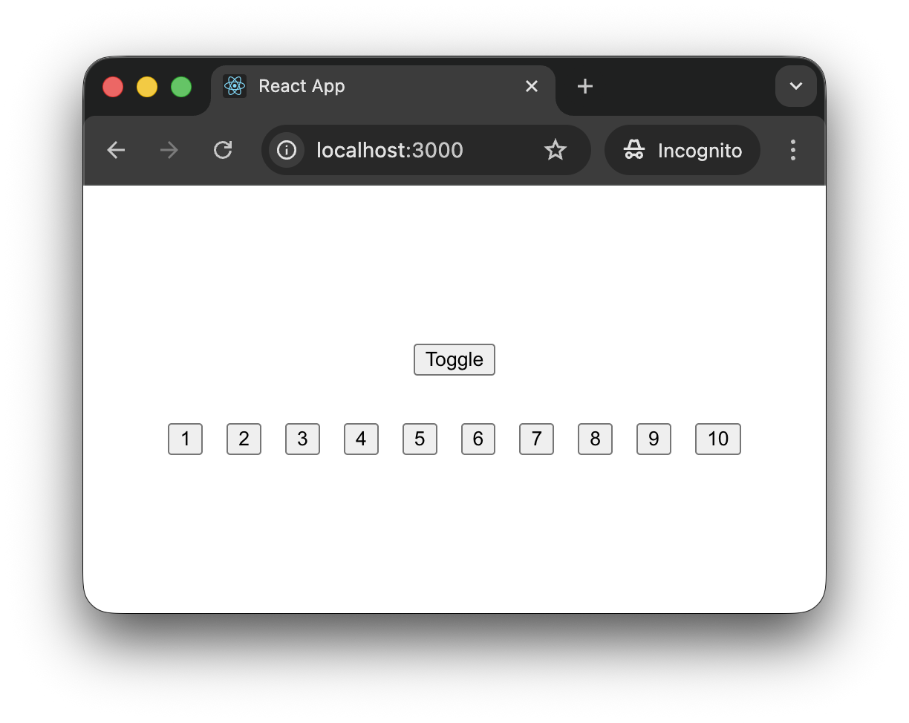
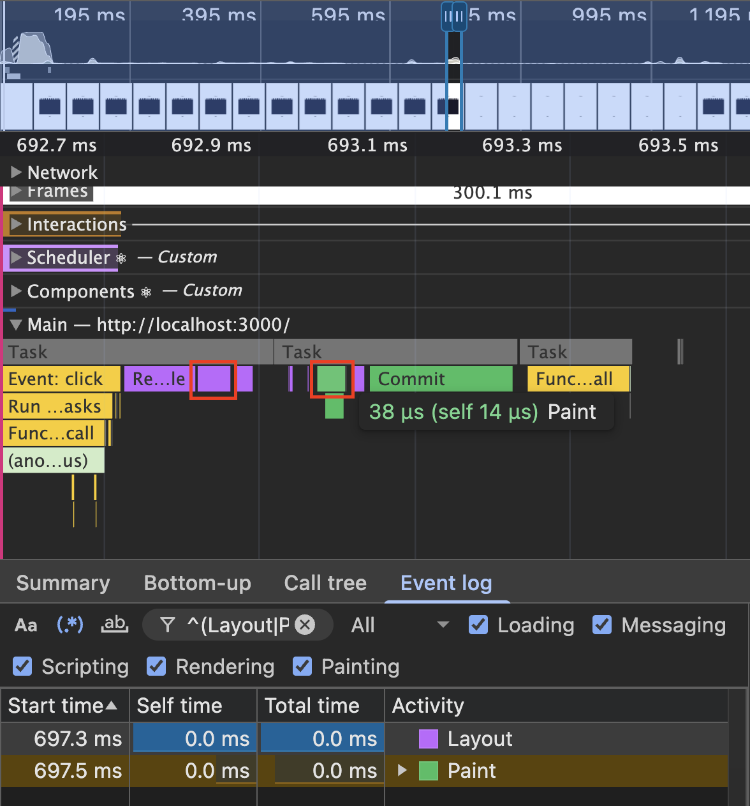
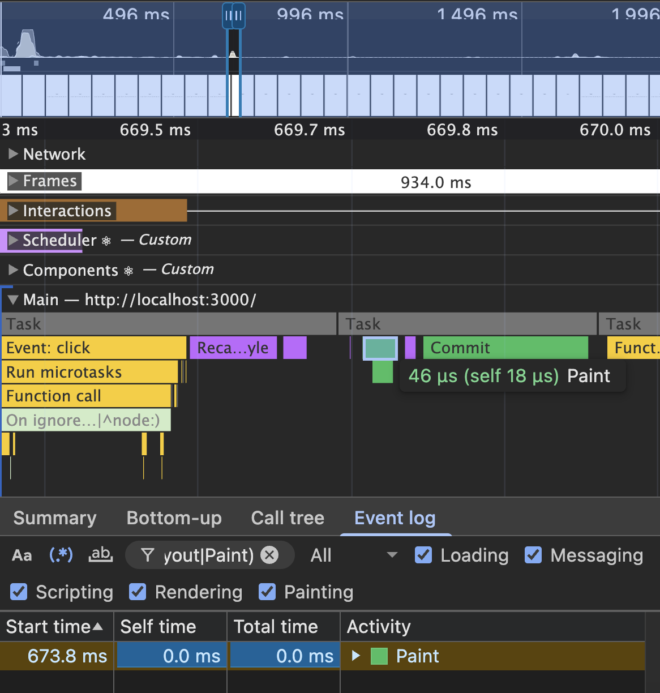
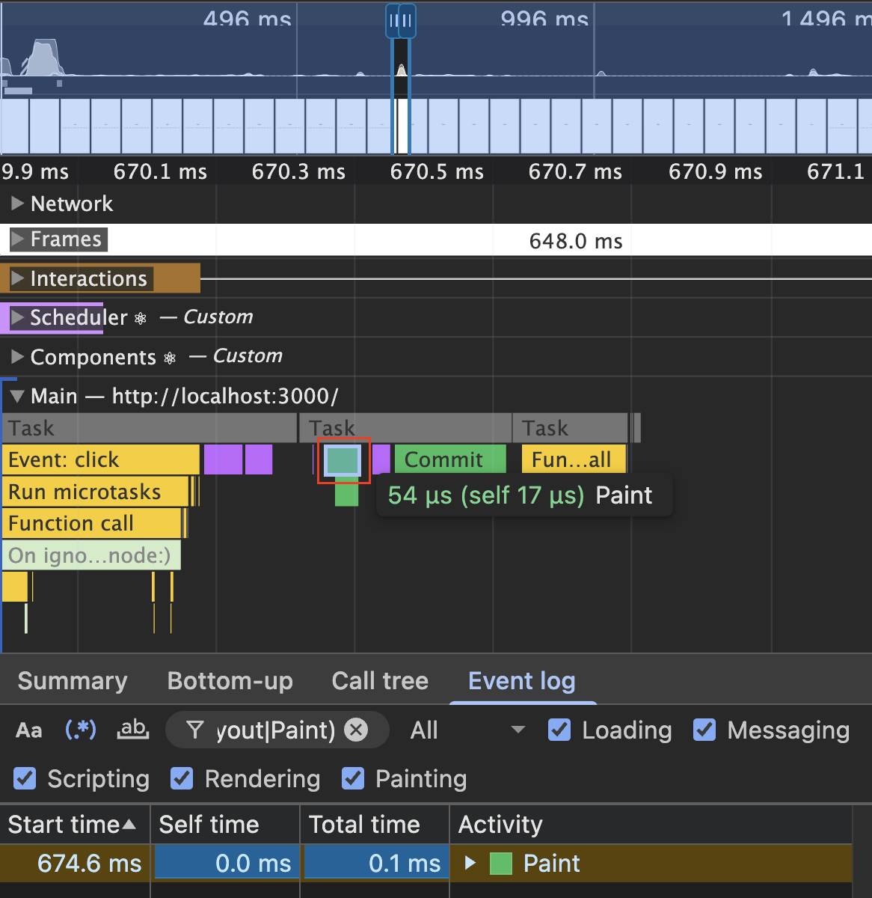
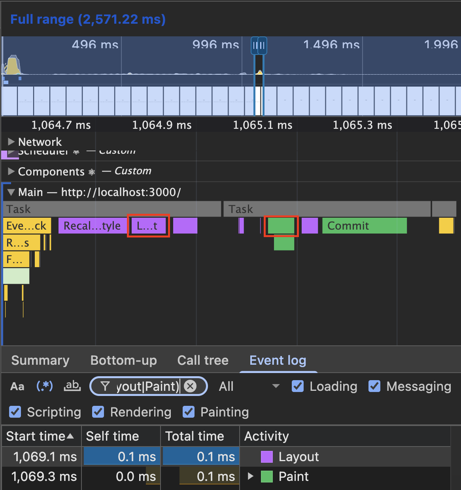
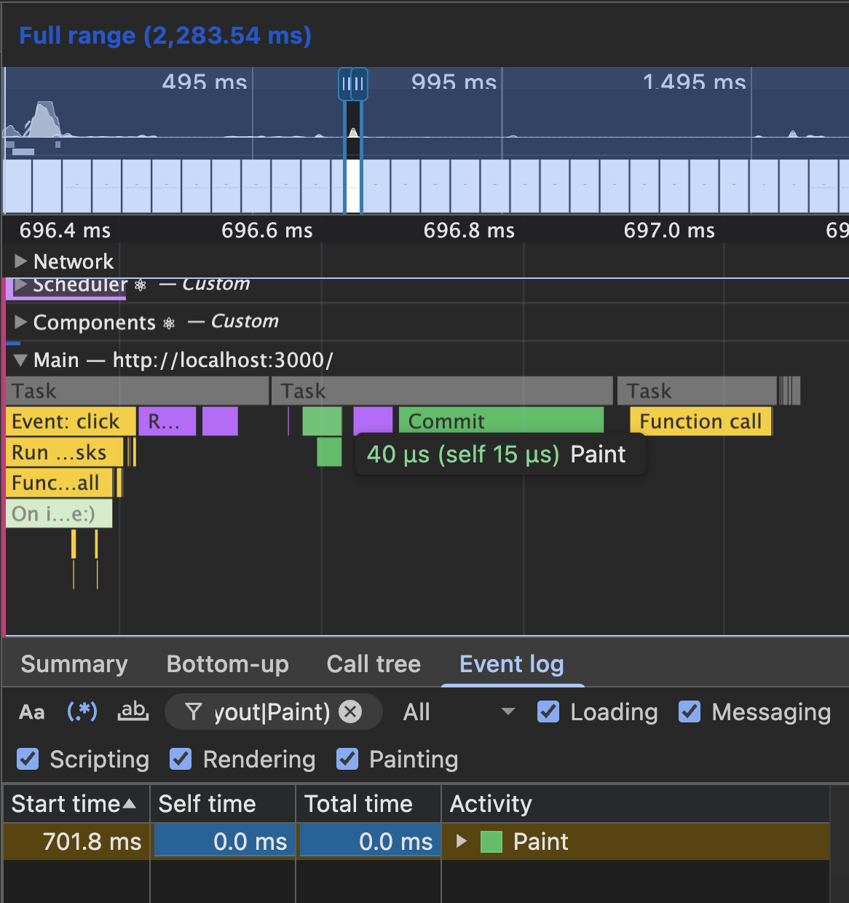
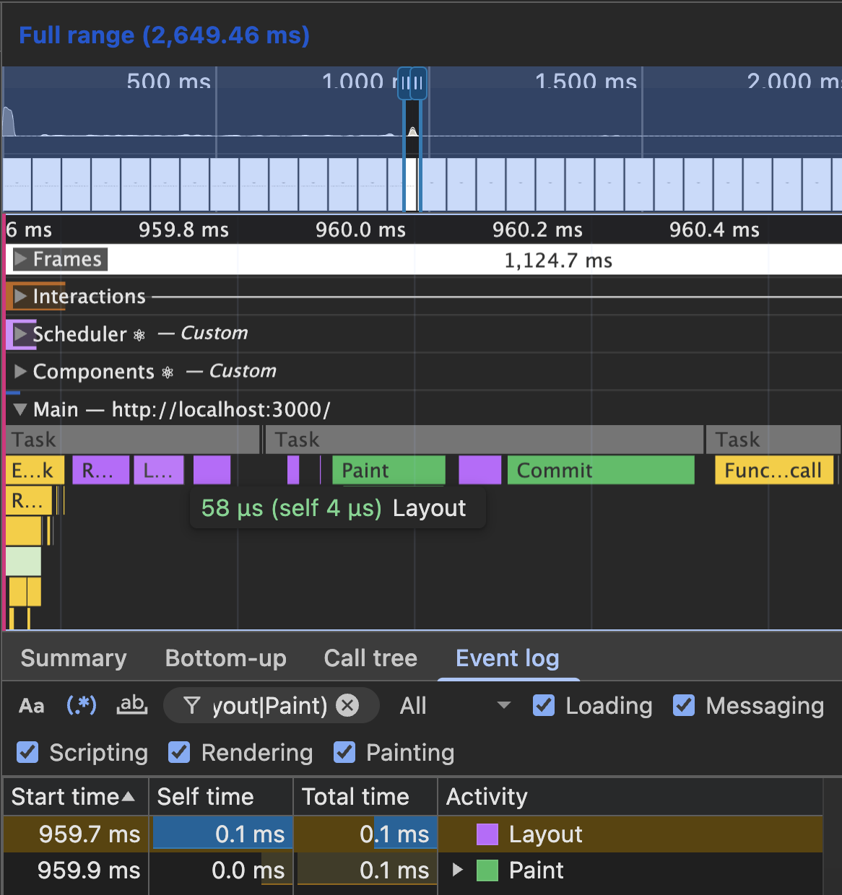
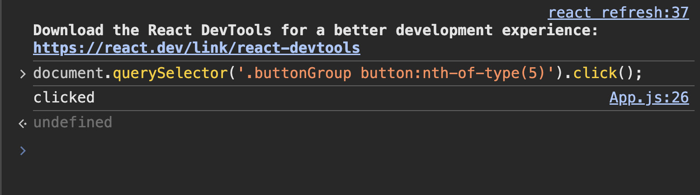

HTML에서 특정 요소(`element`)를 숨김 처리할 때 활용할 수 있는 CSS 속성들은 다양하다.

> `display`, `visibility`, `opacity`, `transform`, `clip-path`, `height`

각 속성은 **스크린 리더의 해석 대상에 포함**되거나, **레이아웃 시프트를 발생**시키거나, 또는 **인터랙션을 제한**하는 등 사용 목적의 차이가 존재하다.

따라서 숨김 처리를 적용할 요소는 기능 요구사항에 맞는 적절한 CSS를 적용하는 것이 중요하다.

이번 게시글에서는 `display`, `visibility`, `opacity`, `transform,` 이 4가지 CSS 속성을 통해 숨김을 적용했을 때 브라우저에서 발생하는 내부 동작(`Layout`, `Paint`)들을 비교한 내용들을 하단의 리액트 예시 코드를 통해 정리한다.

{: width="550"}

```jsx
import { useState } from 'react';
import clsx from 'clsx';

import './App.css';

const BUTTON_GROUP_COUNT = 10;

export default function App() {
  const [isButtonGroupHidden, setIsButtonGroupHidden] = useState(false);

  return (
    <div className='App'>
      <button
        onClick={() => {
          setIsButtonGroupHidden((prev) => !prev);
        }}
      >
        Toggle
      </button>

      <div className={clsx('buttonGroup', { hidden: isButtonGroupHidden })}>
        {Array.from({ length: BUTTON_GROUP_COUNT }, (_, index) => (
          <button key={index}>{index + 1}</button>
        ))}
      </div>
    </div>
  );
}
```

```css
.App {
  width: 100vw;
  height: 100vh;
  display: flex;
  flex-direction: column;
  justify-content: center;
  align-items: center;
  gap: 2rem;
}

.buttonGroup {
  display: flex;
  justify-content: center;
  gap: 1rem;

  &.hidden {
    /* 숨김 방법(1) */
    display: none;

    /* 숨김 방법(2) */
    visibility: hidden;

    /* 숨김 방법(3) */
    opacity: 0;

    /* 숨김 방법(4) */
    transform: scale(0);
  }
}
```

코드를 이해하기 쉽게 추상화한다면 다음과 같다.

> "해당 코드는 `Toggle` 버튼을 클릭함으로써 10개의 버튼을 `숨김`/`표시` 처리하는 기능을 포함하고 있다.

<br />

## 방법(1) : `display: none`

`display: none` 속성이 `<div>` 요소에 적용되면 `Recalculate Style` 단계에서
해당 스타일이 계산된다. 이 과정에서 요소는 **렌더 트리에서 제거**되며, 요소가 차지하던 공간이 사라지면서 **주변 요소들의 위치와 크기가 재계산**된다. 이러한 레이아웃 변경으로 인해 Layout(`Reflow`)이 발생하고,
이후 변경된 내용을 화면에 다시 그리는 Paint(`Repaint)` 단계가 실행된다.

따라서 `display: none` 속성이 적용되는 요소는 레이아웃에 영향을 주므로, 하단의 이미지와 같이 `Layout`, `Paint` 단계를 모두 발생시킨다.

{: width="550"}

특징은 요소의 유저 인터랙션이 불가하며(`DOM Selector는 가능`), 키보드 포커스(<kbd>Tab</kbd>)가 불가하고, 스크린 리더의 해석 대상에서 제외된다.

<br />

## 방법(2) : `visibility: hidden`

`visibility: hidden` 속성이 `<div>` 요소에 적용되면 `Recalculate Style` 단계에서
해당 스타일이 계산된다. 이 과정에서 요소는 **렌더 트리에 유지**되지만 시각적으로만 숨김 처리되며, **요소가 차지하던 공간은 그대로 유지**된다. 주변 요소들의 위치나 크기에 영향을 주지 않기 때문에 Layout(`Reflow`)은 발생하지 않고, 요소를 화면에 그리지 않기 위한 Paint(`Repaint`) 단계만 실행된다.

따라서 `visibility: hidden` 속성이 적용되는 요소는 레이아웃에 영향을 주지 않으므로, 하단의 이미지와 같이 `Layout` 단계를 건너뛰고 `Paint` 단계만 발생시킨다.

{: width="550"}

특징은 `display: none`과 비슷하게 동작하지만, `visibility: hidden`이 적용된 요소는 렌더 트리에 유지되기 때문에 레이아웃 공간을 여전히 차지한다는 차이가 있다.

<br />

## 방법(3) : `opacity: 0`

이 방법은 `opacity: 0` 속성을 적용할 요소의 기설정 값에 따라 2가지 결과가 나타난다.

> 1. _N_ is less than 1
> 2. _N_ is equal to 1

첫 번째는 *`N`*이 기존에 `1` 미만으로 설정된 경우이다. 이 케이스에서는 하단의 이미지와 같이 `Layout` 단계를 건너뛰고 `Paint` 단계만 발생된다.

{: width="550"}

그 이유는 [MDN opacity CSS Description](https://developer.mozilla.org/en-US/docs/Web/CSS/Reference/Properties/opacity#description){:target="\_blank"} 섹션의 내용을 통해 알 수 있었다.

> "Using opacity with a value other than 1 places the element in a new stacking context."

`opacity`가 `1` 미만인 값을 사용하면, 새로운 [stacking context에](https://developer.mozilla.org/en-US/docs/Web/CSS/Guides/Positioned_layout/Stacking_context){:target="\_blank"} 배치되므로, 값을 `0`으로 변경하더라도 다른 레이아웃에 영향이 가지 않아 `Layout` 단계가 발생하지 않는다. 문서의 설명으로는 **`1`이 아닌 값**으로 기술되어 있지만 `1`을 초과하는 값으로 설정한 후 `0`으로 변경하는 경우에는 `Layout`이 발생한다.

두 번째는 *`N`*이 기존에 `1`(Default Value)로 설정된 경우이다. 이 케이스에서는 하단의 이미지와 같이 `Layout`, `Paint` 단계가 모두 발생된다는 차이점이 존재한다.

{: width="550"}

따라서 `opacity` 속성을 사용하여 특정 요소를 숨김 처리하려고 할 때 `Layout` 단계를 생략시키려면, 적용할 요소에 미리 `1` 미만의 값(e.g., `0.999...`)으로 설정해 두는 것이 미미하지만 성능적으로 도움이 될 것이다.

특징은 요소의 투명도만 조절되는 것이기 때문에 렌더 트리에서 유지되어 레이아웃 공간을 그대로 차지하고, 유저 인터랙션이 가능하다. 따라서 키보드 포커스가 가능하며 스크린 리더의 해석 대상으로 포함된다는 `visibility` 속성과의 차이가 있다.

보통 `opacity`, `transform` 속성은 요소의 레이아웃에 직접적인 영향을 주는 속성은 아니라고 알려져 있지만, 스타일 재계산 과정에서 브라우저가 레이아웃을 검증하거나 재사용 여부를 판단하면서 `Layout` 단계가 함께 기록되는 것 같다.

> 이 부분은 [RenderingNG 아키텍처](https://developer.chrome.com/docs/chromium/renderingng-architecture?hl=ko){:target="\_blank"}를 공부해 보고 다시 기록해 보겠다.

<br />

## 방법(4) : `transform: scale(0)`

이 방법도 `transform: scale(0)` 속성을 적용할 요소의 기설정 값에 따라 2가지 결과가 나타난다.

첫 번째는 `scale`에 적용된 값이 기존에 `0`이 아닌 경우이다. 이 케이스에서는 값을 `0`으로 변경하더라도 `opacity`와 같이, 다른 레이아웃에 영향이 가지 않아 `Layout` 단계가 발생하지 않는다.

{: width="550"}

두 번째는 `scale`에 적용된 값이 기존에 `none`(Default Value)로 설정된 경우이다. 이 케이스에서는 하단의 이미지와 같이, `Layout`, `Paint` 단계가 모두 발생된다는 차이점이 존재한다.

따라서 `transform` 속성도 `opacity`와 같이, `Layout` 단계를 생략시키려면, 해당 요소에 `scale(1)` 값을 미리 설정해 두는 것이 좋을 것이다.

{: width="550"}

특징은 요소가 시각적으로만 축소되어 보이지 않을 뿐, 렌더 트리와 레이아웃 공간은 그대로 유지된다는 점이다. `0`의 크기로 축소되었기 때문에 클릭과 같은 유저 인터랙션이 불가능하지만, 키보드 포커스(<kbd>Tab</kbd>)가 가능하기 때문에 포커스를 이용해 <kbd>Enter</kbd>, <kbd>Space Bar</kbd> 키의 입력으로 클릭이 가능하다. 따라서 스크린 리더의 해석 대상에 포함된다.

<br />

위 4가지 방법의 특징을 비교하면 다음과 같다.

| CSS 속성              | 레이아웃 공간 차지 | Layout | Paint | 마우스 클릭 | 키보드 포커스 | 스크린 리더 |
| --------------------- | ------------------ | ------ | ----- | ----------- | ------------- | ----------- |
| `display: none`       | ✗                  | ✓      | ✓     | ✗           | ✗             | ✗           |
| `visibility: hidden`  | ✓                  | ✗      | ✓     | ✗           | ✗             | ✗           |
| `opacity: 0`          | ✓                  | ✓/✗    | ✓     | ✓           | ✓             | ✓           |
| `transform: scale(0)` | ✓                  | ✓/✗    | ✓     | ✗           | ✓             | ✓           |

참고로 CSS를 통해 JS 이벤트를 제한하는 것은 불가하므로, 해당 경우에는 조건부 렌더링 방식을 사용해 DOM에 포함되지 않도록 처리해야 한다.

{: width="550"}

<br />

## 📝 마치며

`display`, `visibility`, `opacity`, `transform` 속성을 이용해 요소를 숨겼을 때 브라우저 렌더링 과정에서 어떤 차이가 발생하는지 살펴보았다.

각 속성은 모두 요소를 보이지 않게 만들지만, **렌더 트리 포함 여부, 레이아웃 영향, 인터랙션 가능 여부**에서 서로 다른 특징을 가진다.

특히 렌더링 관점에서 보면 `display: none`은 요소가 렌더 트리에서 제거되면서 `Layout`과 `Paint`가 모두 발생하지만, `visibility`, `opacity`, `transform`은 레이아웃 구조를 유지한 채 시각적인 표현만 변경되기 때문에 `Layout` 단계를 건너뛸 수 있다.

따라서 요소를 단순히 숨기기 위한 목적이라면, `visibility`, `opacity`, `transform`을 사용하는 것이 렌더링 성능 측면에서 조금 더 유리할 수 있다. 동기적으로 숨김 처리가 필요한 상황이라면, `Layout`을 발생시키지 않는 이러한 방식이 더욱 유리해질 것이다. 다만 실제 UI 구현에서는 **성능뿐 아니라 인터랙션, 접근성(A11y), 레이아웃 안정성**까지 함께 고려하여 기능 요구사항에 맞는 속성을 선택하는 것이 중요하다.

- [opacity](https://developer.mozilla.org/en-US/docs/Web/CSS/Reference/Properties/opacity#description)
- [Stacking context](https://developer.mozilla.org/en-US/docs/Web/CSS/Guides/Positioned_layout/Stacking_context)
