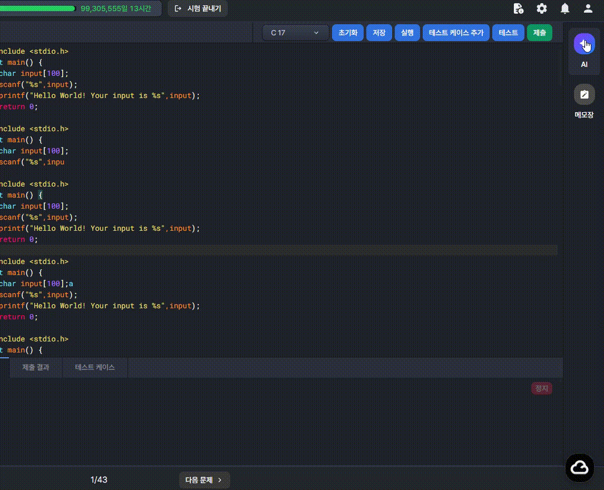
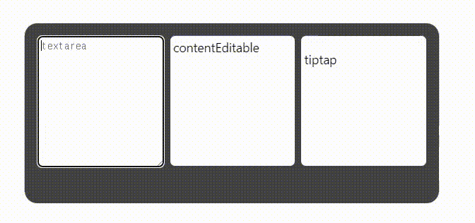
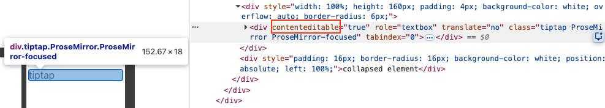

## 작성 배경

{: width="550"}

<figcaption>Windows 환경에서 textarea 태그에 텍스트 입력 후 PgDn/PgUp 키가 작동되도록 입력했을 때 우측에 collapsing된 UI가 노출됨</figcaption>

<br />

## 원인

페이지 우측에 collapsing된 UI를 포함하는 부모 element에서 사용한 `overflow: hidden;` 속성 값으로 인해 생성된 BFC(Block Formatting Context))가 원인.

### <kbd>PgUp</kbd>, <kbd>PgDn</kbd> 키의 역할

<kbd>PgUp</kbd>, <kbd>PgDn</kbd> 키는 기본적으로 문서나 화면을 한 화면 단위로 이동할 때 쓰는 키입니다. <kbd>PgDn</kbd>은 아래로, <kbd>PgUp</kbd>은 위로 이동합니다


#### BFC란?

BFC(Block Formatting Context)는 CSS 레이아웃에서 독립적인 블록 렌더링 영역이다. BFC가 형성된 요소는 자기만의 레이아웃 규칙을 가진 독립된 컨테이너가 되며, 내부와 외부가 서로 영향을 주지 않는다.

<br />

## 영향 범위

macOS의 주요 브라우저(Chrome, Edge, Opera, Safari, Firefox, Whale, Arc)에서는 <kbd>PgUp</kbd>, <kbd>PgDn</kbd> 키 입력으로 인한 사이드 이펙트는 없었다. 다만, Windows에서는 Firefox를 제외한 Chromium 기반 브라우저에들서는 위에서 언급한 BFC로 인해 offscreen 처리된 UI가 노출되는 이슈가 확인됐다.

{: width="550"}

```tsx
import { EditorContent, useEditor } from "@tiptap/react";
import StarterKit from "@tiptap/starter-kit";

function App() {
  const editor = useEditor({
    extensions: [StarterKit],
    content: "<p>tiptap</p>",
  });

  return (
    <div
      className="App"
      style={{
        display: "flex",
        justifyContent: "center",
        alignItems: "center",
        width: "100%",
        height: "100vh",
      }}
    >
      <div
        style={{
          width: "500px",
          height: "200px",
          padding: "16px",
          display: "flex",
          gap: "8px",
          position: "relative",
          backgroundColor: "#444",
          borderRadius: "16px",
          overflow: "hidden",
        }}
      >
        <textarea
          placeholder="textarea"
          style={{
            width: "100%",
            height: "160px",
            padding: "4px",
            backgroundColor: "white",
            overflow: "auto",
            borderRadius: "6px",
          }}
        />

        <div
          contentEditable
          style={{
            width: "100%",
            height: "160px",
            padding: "4px",
            backgroundColor: "white",
            overflow: "auto",
            borderRadius: "6px",
          }}
        >
          contentEditable
        </div>

        <EditorContent
          editor={editor}
          style={{
            width: "100%",
            height: "160px",
            padding: "4px",
            backgroundColor: "white",
            overflow: "auto",
            borderRadius: "6px",
          }}
        />

        <div
          style={{
            padding: "16px",
            borderRadius: "16px",
            backgroundColor: "white",
            position: "absolute",
            left: "100%",
          }}
        >
          collapsed element
        </div>
      </div>
    </div>
  );
}

export default App;
```

<br />

지금까지 확인된 요소는 `<textare>`, [contentEditable](https://developer.mozilla.org/ko/docs/Web/HTML/Reference/Global_attributes/contenteditable) 속성이 부여된 element들이다.

{: width="100%"}

<figcaption>tiptap과 같은 WYSIWYG 에디터도 내부적으로 contenteditable 속성이 적용되어 있음으로 영향 범위에 속함</figcaption>

<br />

## 해결 방법

이슈의 트리거가 되는 collapsing된 UI를 포함하는 부모 측 element에 `overflow: clip;` 속성 값을 사용하면 된다.
> `overflow: clip`은 `overflow: hidden`과 동일하게 영역 바깥의 콘텐츠를 시각적으로 잘라내지만, BFC를 생성하지 않는다. BFC가 없으면 브라우저가 해당 요소를 스크롤 가능한 컨테이너로 인식하지 않기 때문에, <kbd>PgUp</kbd>, <kbd>PgDn</kbd> 키 입력이 BFC 내부를 스크롤시키는 현상 자체가 발생하지 않는다.

문제는 동일한 브라우저 프로그램을 사용함에도 <kbd>PgUp</kbd>, <kbd>PgDn</kbd> 키의 입력을 통해 스크롤 되는 경우가 운영체제별로 달랐다는 점이다.

Windows를 오랜 시간 사용해 오던 사용자라면, 문서 작성 간에 <kbd>PgUp</kbd>, <kbd>PgDn</kbd> 키를 커서의 위치를 변경하기 위해 사용할 수 있다는 점을 알고 있을 것이다. 다만, macOS를 사용해 오던 사용자라면 기본 프로그램들에서 해당 기능은 대부분 지원하지 않기에 인식하지 못 할 수 있다.

따라서 해당 기능의 존재 여부는 각 프로그램에 의존된다고 정리할 수 있다.

<br />

## 📝 마무리

서비스에서 일관된 사용자 경험을 제공하는 것은 제품의 신뢰성을 보장하는 것과 같다고 생각한다. 사용자의 혼란을 유발하지 않도록 유의하며 피처를 개발하자.

<br />

### 참고

- [contentEditable](https://developer.mozilla.org/ko/docs/Web/HTML/Reference/Global_attributes/contenteditable)
