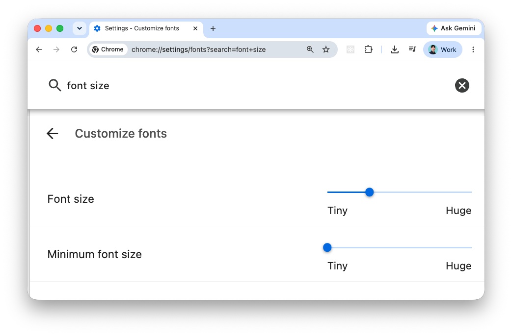
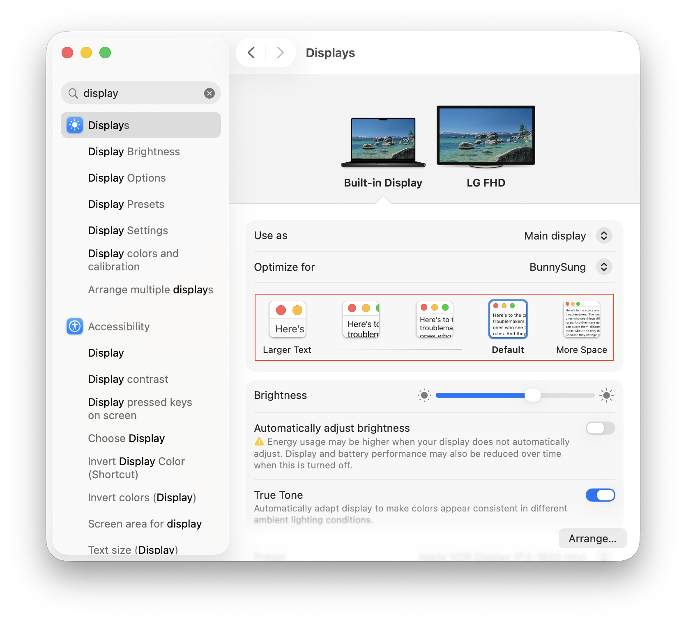
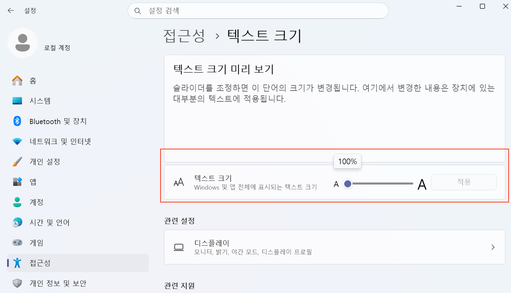

## 작성 배경

{: width="100%"}

브라우저의 font size 설정을 변경했을 때 사이트의 비율이 달라지는 것을 막는 방법을 공유하고, 방지할 필요가 있었는지에 대한 나의 생각을 기록한다.

 

## 원인

[:root CSS pseudo-class](https://developer.mozilla.org/en-US/docs/Web/CSS/Reference/Selectors/:root)에서 `font-size(px)` 속성을 선언하지 않았기 때문이다.

 

## 해결 방법

앱의 전역 CSS 파일로 사용하는 `index.css`, `globals.css` 파일 등에서 `:root` 의사 클래스 내 `font-size` 속성을 선언해 주면 된다.

`rem` 단위의 `r`도 `root`이므로 `body`, `html` 속성이 아닌, `:root` 의사 클래스의 속성으로 선언해 주는 것이다. 실제로 `:root` 의사 클래스 이외의 클래스에서 선언한 `font-size` 속성은 `em` 단위에는 영향을 주지만, `rem` 단위에는 영향을 주지 않는다.

이때 주의할 점은 `font-size` 속성을 선언할 때 `px` 단위를 사용해야 한다는 것이다. 기준이 되는 값을 선언해야 하는데, `rem` 단위를 그대로 사용하는 것은 무의미하다.

 

## 그럼 접근성(A11y)은?

아이러니하게도 `rem` 단위를 사용할 때 `:root`에 `font-size`을 `px` 단위로 설정하면, 브라우저에서 font size 설정을 조작하더라도 페이지에는 아무런 변화가 없을 것이다. 이 부분은 주로 글자 크기를 크게 보는 시니어 사용자분들께는 불편함이 될 수 있고, 페이지가 브라우저의 설정을 무시하는 방식이라는 점에서 접근성이 저해된다.

{: width="70%"}

<figcaption>Font size 설정이 페이지에서 아무런 영향을 주지 않음</figcaption>

 

그럼에도 필자가 `px`로 `rem` 단위의 기준을 세우는 것의 이점을 높게 본 까닭은 다음과 같다.

- 제품의 디자인 일관성 보장

  > CS로 인입되는 문의에서 종종 브라우저 브라우저 글자 크기 설정으로 인해 `작성 배경`의 예시와 같이 디자이너님께서 의도하신 레이아웃과 다른 뷰가 노출되는 경우가 있다. 이는 제품을 유지 관리하는 측면에서 다양한 방식으로 레이아웃이 변경되는 경우들을 일일이 대응하는 것이 어렵고, 제품의 UI 일관성을 저해하므로 사용자에게 부정적 경험이 될 수 있음. 하지만, px 기준이 있었다면, OS 시스템 설정을 변경한 경우를 제외하고 대부분의 사용자들에게 통일된 레이아웃을 제공할 수 있다.

- 페이지의 폰트 크기는 OS 시스템 설정으로도 조작이 가능하다.
  > 때문에 브라우저 설정의 영향을 받지 않아도 괜찮다고 판단했다. 특정 브라우저의 폰트 크기만 조작하고 싶은 경우에는 페이지 확대/축소 기능으로 대체할 수 있다고 생각했다(모든 페이지에 일관된 비율로 설정하는 것은 어려울 것으로 예상). 그리고, 글자 크기 조절이 필요한 사용자들은 보통 사용 중인 모든 프로그램마다 해당 설정을 조작하지 않고, 시스템 설정 하나로 동시에 처리되길 원할 것이라 생각함.

{: width="75%"}

<figcaption>macOS 시스템 설정</figcaption>

{: width="75%"}

<figcaption>Windows 11 시스템 설정</figcaption>

- (선택) rem 단위의 변환 값을 조직의 규칙에 따라 설정할 수 있다.

  > 1rem은 px로 변환했을 때 기본 값이 16px이다. 하지만, 이를 `font-size: 10px` 등으로 설정할 수 있다. 그럼 코드 에디터 내에서 `px to rem` extension을 굳이 설치하여 사용하지 않아도 쉽게 변환할 수 있다. 하지만, 대부분의 개발자가 `16px equals 1rem`으로 생각하므로, 이 부분은 신중히 결정해야 할 것 같다.

 

## 📝 마무리

웹 접근성을 고려하는 것은 모든 이에게 제품이 갖고 있는 정보와 기능을 최대한 동등하게 보장하기 위해 지켜야 하는 기준이라고 생각한다. 하지만, 이번 케이스처럼 접근성과 디자인 일관성이 충돌하는 상황에서는 트레이드오프를 인지하고, 제품의 성격에 맞게 선택하는 것이 현실적일 것이다.

중요한 것은 어떤 방식을 선택했느냐보다, 그 선택의 결과가 사용자 경험에 어떤 영향을 미치는지 이해하고 결정하는 데 있다.

 

### 참고

- [:root CSS pseudo-class](https://developer.mozilla.org/en-US/docs/Web/CSS/Reference/Selectors/:root)
