## 작성 배경

디자이너님께서 제작해 주신 텍스트 스타일을 CSS 코드로 동일하게 맞춰줬으나, 브라우저에 렌더링된 폰트의 느낌과 상이

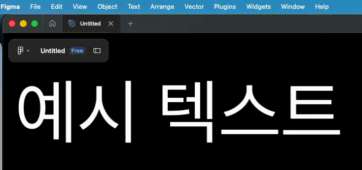{: width="550"}

<figcaption>font-weight가 다르게 보임</figcaption>

이 때문에 디자인 QA 간에 `font-weight` 값을 빈번히 브라우저에서 확인하던 번거로움을 없애기 위해 차이가 발생하는 원인과 해결 방법을 조사

<br />

## 원인

폰트를 화면에 렌더링하는 방식이 운영체제별로 다르다는 점이다. 그중에서 직접적인 원인은 `Anti-Aliasing`의 적용 유무이다. 이는 CSS 속성을 어느 정도 해소할 수 있다. 통해 실제로 확인해 본 결과는 다음과 같다.

> MDN 페이지에서 직접 비교해 볼 수 있다. [Web results font-smooth CSS property - MDN Web Docs](https://developer.mozilla.org/en-US/docs/Web/CSS/Reference/Properties/font-smooth#examples){:target="\_blank"}

- macOS(Tahoe)

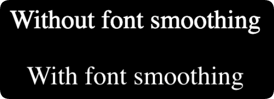{: width="550"}

<figcaption>첫 이미지와 동일하게 font-weight가 다르게 보임</figcaption>

- Windows(11)

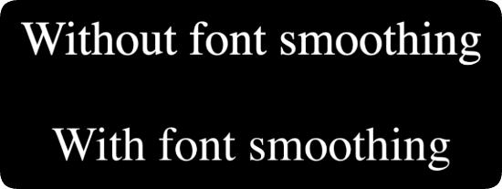{: width="550"}

<figcaption>큰 차이가 없어 보임</figcaption>

<br />

## Anti-Aliasing이란?

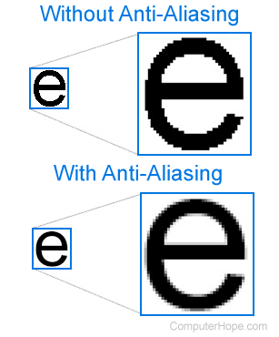{: width="250"}

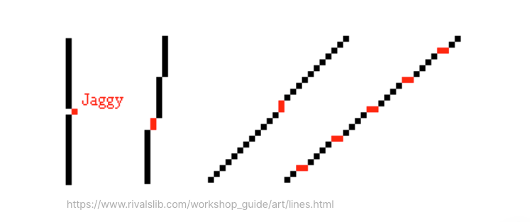{: width="450"}

디지털 이미지에서 픽셀 기반 표현으로 인해 발생하는 **계단 현상(jaggies)**을 완화하여 경계선을 더 부드럽게 보이도록 하는 기술이다.

<br />

### 알아볼 Anti-Aliasing 종류

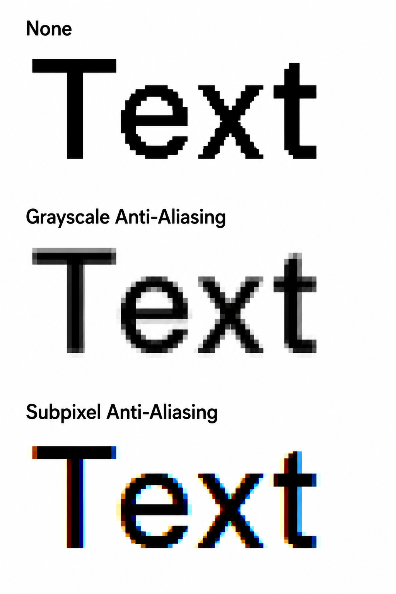{: width="300"}

1. `Grayscale Anti-Aliasing` : 픽셀 단위로 색을 채울 때, 경계선에 걸친 픽셀을 회색조(중간 밝기) 로 채워 계단 현상을 완화하는 방식.
   > - 픽셀은 켜짐/꺼짐이 아니라 0~255 사이의 값으로 표현됨
   > - 경계에 걸친 비율만큼 밝기를 조절해 시각적으로 부드러운 외곽선을 만듦
   > - 흑백 또는 단색 렌더링(폰트, 아이콘 등)에 주로 사용
2. `Subpixel Anti-Aliasing` : 픽셀 하나가 RGB 세 개의 서브픽셀로 구성된 점을 활용해, 픽셀보다 더 세밀한 단위로 경계를 표현하는 방식.
   > - 가로 해상도를 사실상 3배로 활용 가능(서브픽셀 R·G·B를 개별 제어하기 때문)
   > - 디스플레이의 서브픽셀 배열에 의존하기 때문에, 모니터 종류에 따라 결과가 달라질 수 있음
   > - Windows의 ClearType 대표적인 사례
   > - 고해상도(Retina) 디스플레이에서는 효과가 미미해 잘 사용하지 않음(Retina 디스플레이는 픽셀 밀도가 매우 높아서, 픽셀 자체가 너무 작아 서브픽셀 단위로 제어해도 눈으로 차이를 인식하기 어렵기 때문)

## macOS의 폰트 표시 방식

macOS는 [Core Text](https://developer.apple.com/documentation/coretext/){:target="\_blank"} 레이아웃 엔진을 통해 폰트 레이아웃을 처리한다.

이 Core Text에서 구체적으로 어떤 AA 방식을 사용한다는 내용은 찾지 못 했으나, macOS에서 렌더링되는 폰트로부터 계단 현상을 경험한 적이 없었으므로 Grayscale Anti-Aliasing(이하 'AA') 자체는 지원하는 것으로 생각된다.

추가로, **macOS Mojave**(10.14, 2018.09.24)에 버전부터 [Subpixel AA가 비활성화 되었다는 글](https://www.howtogeek.com/358596/how-to-fix-blurry-fonts-on-macos-mojave-with-subpixel-antialiasing/){:target="\_blank"}을 확인했다.

해당 글에 의하면, `CGFontRenderingFontSmoothingDisabled` 속성 값을 변경하는 것으로 과거 버전에서 기본으로 사용되던 Subpixel AA를 다시 활성화할 수 있다고 한다. 그러나, 필자가 사용 중인 Tahoe 버전에서는 `CGFontRenderingFontSmoothingDisabled` 속성 값을 변경하더라도 폰트의 차이를 느낄 수 없었다. 고해상도인 Retina 디스플레이를 사용 중이라 그랬을 수도 있을 것 같다.

> Apple은 2012년에 출시한 MacBook Pro 모델 이전까지는 LED 백라이트 디스플레이를 사용해 왔다. 그리고, 하드웨어의 스펙이 향상됨에 따라 특정 macOS 버전(Mojave)부터는 디스플레이에서 렌더링되는 폰트의 AA 적용 방식에도 변화를 줄 필요가 있었던 게 아닌가 싶다.

그러나, `AppleFontSmoothing` 속성 값을 `0`으로 설정함으로써 Apple의 Font smoothing을 적용하지 않았을 때는 폰트의 차이점을 확인할 수 있었다.

```zsh
defaults -currentHost write -globalDomain AppleFontSmoothing -int 0
```

<br />

원복은 하단의 명령어 실행 후 시스템 재부팅(또는 로그아웃)을 진행하면 된다.

```zsh
defaults -currentHost delete -globalDomain AppleFontSmoothing
```

<br />

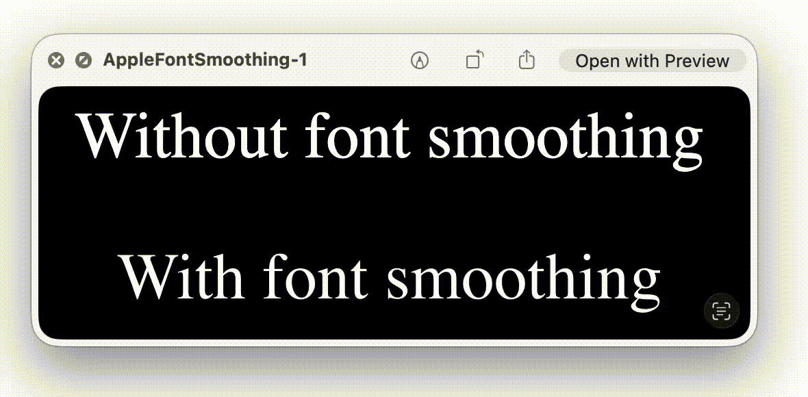{: width="650"}

<figcaption>AppleFontSmoothing를 0으로 설정하면 macOS의 기본 font smoothing이 꺼진다</figcaption>

정리하면, macOS에서는 `AppleFontSmoothing` 속성을 0으로 설정하면, 브라우저에서 AA가 적용했을 때와 거의 동일한 폰트를 확인할 수 있다. 그러나, 운영체제에서는 해당 속성의 기본 상태가 기본적으로 활성화되어 있으므로, 여러 팀원(Product Designer/Engineer)과 일관된 환경에서 함께 작업하려면 기본 상태를 유지하는 것이 바람직해 보인다.

<br />

## Windows의 폰트 표시 방식

Windows는 [ClearType](https://learn.microsoft.com/en-us/dotnet/desktop/wpf/advanced/cleartype-overview){:target="\_blank"}이라는 Microsoft에서 개발할 소프트웨어가 사용된다. 이는 노트북 화면, Pocket PC 화면, 평면 모니터 등 기존의 LCD에서 텍스트의 가독성을 높이는 기술이라고 한다.

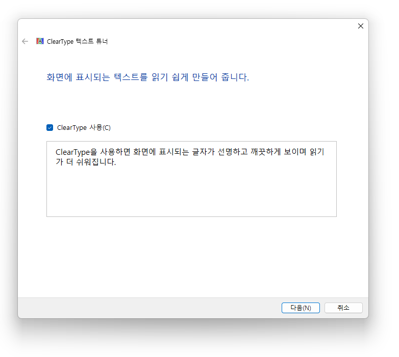{: width="650"}

ClearType은 설정을 통해 제어할 수 있으나, 해당 설정만으로는 Windows 내 모든 프로그램 및 시스템 폰트에서 AA 비활성화가 적용되지 않아 superuser 게시글들 중 [답변 내용](https://superuser.com/a/1762570){:target="\_blank"}을 통해 해제가 가능했다.

요약하면, 하단의 레지스트리를 통해 AA를 비활성화 해 볼 수 있었다. 실제로 해당 레지스트리를 실행했을 때 기본 값이 활성화 상태이던 ClearType이 함께 비활성화되어 있는 부분을 확인할 수 있었다. 역할은 폰트를 `Segoe UI` → `한국어 폰트(돋움)`로 교체하고, 폰트 AA를 비활성화 하는 것이다.

```env
Windows Registry Editor Version 5.00

[HKEY_CURRENT_USER\Control Panel\Desktop]
"FontSmoothing"="0"

[HKEY_LOCAL_MACHINE\SOFTWARE\Microsoft\Windows NT\CurrentVersion\Fonts]
"Segoe UI (TrueType)"=""
"Segoe UI Black (TrueType)"=""
"Segoe UI Black Italic (TrueType)"=""
"Segoe UI Bold (TrueType)"=""
"Segoe UI Bold Italic (TrueType)"=""
"Segoe UI Historic (TrueType)"=""
"Segoe UI Italic (TrueType)"=""
"Segoe UI Light (TrueType)"=""
"Segoe UI Light Italic (TrueType)"=""
"Segoe UI Semibold (TrueType)"=""
"Segoe UI Semibold Italic (TrueType)"=""
"Segoe UI Semilight (TrueType)"=""
"Segoe UI Semilight Italic (TrueType)"=""

[HKEY_LOCAL_MACHINE\SOFTWARE\Microsoft\Windows NT\CurrentVersion\FontSubstitutes]
"Segoe UI"="Dotum"
```

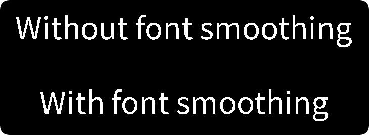{: width="550"}

<figcaption>AA 비활성화 시 계단 현상이 확인된다</figcaption>

원복은 하단의 레지스트리를 실행 후 시스템 재부팅을 진행하면 된다.

```env
Windows Registry Editor Version 5.00

[HKEY_CURRENT_USER\Control Panel\Desktop]
"FontSmoothing"="2"

[HKEY_LOCAL_MACHINE\SOFTWARE\Microsoft\Windows NT\CurrentVersion\Fonts]
"Segoe UI (TrueType)"="segoeui.ttf"
"Segoe UI Black (TrueType)"="seguibl.ttf"
"Segoe UI Black Italic (TrueType)"="seguibli.ttf"
"Segoe UI Bold (TrueType)"="segoeuib.ttf"
"Segoe UI Bold Italic (TrueType)"="segoeuiz.ttf"
"Segoe UI Historic (TrueType)"="seguihis.ttf"
"Segoe UI Italic (TrueType)"="segoeuii.ttf"
"Segoe UI Light (TrueType)"="segoeuil.ttf"
"Segoe UI Light Italic (TrueType)"="seguili.ttf"
"Segoe UI Semibold (TrueType)"="seguisb.ttf"
"Segoe UI Semibold Italic (TrueType)"="seguisbi.ttf"
"Segoe UI Semilight (TrueType)"="segoeuisl.ttf"
"Segoe UI Semilight Italic (TrueType)"="seguisli.ttf"

[HKEY_LOCAL_MACHINE\SOFTWARE\Microsoft\Windows NT\CurrentVersion\FontSubstitutes]
"Segoe UI"=""
```

정리하면, Windows에서는 기본적으로 AA가 적용되고 있었다. 그리고 이는 설정을 통해 적용 유뮤의 제어가 가능하다.

<br />

## Figma의 폰트 표시 방식

Figma의 canvas 영역에 렌더링되는 폰트는 기본적으로 AA가 적용된 상태이다.

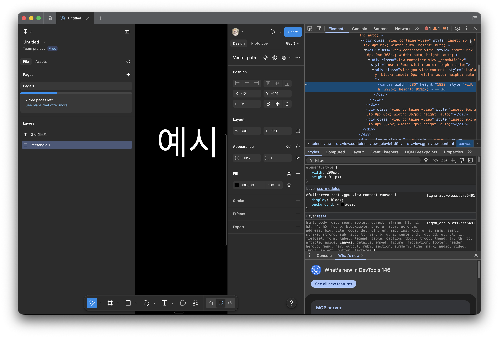{: width="650"}

조사 결과 Figma에서 공식적으로 발표한 AA 관련 게시글은 없었으나, 공식 포럼의 관련 게시글들을 확인했을 때 AA가 기본으로 적용된 상태로 추측된다. 다만, 이를 제어할 수 있는 설저 자체는 아직 Fimga에서 지원하지 않는 것 같다.

- [Add disable Anti-Aliasing for text](https://forum.figma.com/suggest-a-feature-11/add-disable-anti-aliasing-for-text-29525){:target="\_blank"}
- [Add feature to disable Anti-Aliasing entirely](https://forum.figma.com/suggest-a-feature-11/add-feature-to-disable-anti-aliasing-entirely-23696){:target="\_blank"} 렌더링된 폰트 스타일과 Figma가 큰 차이가 없던 것 같다.

<br />

## 해결 방법

가장 중요한 해결 방법은 [CSS 속성](https://developer.mozilla.org/en-US/docs/Web/CSS/Reference/Properties/font-smooth#examples){:target="\_blank"}으로 폰트 차이를 거의 해소할 수 있다. Windows는 기본 상태로도 큰 차이가 거의 없었으니 생략하고, macOS의 경우만 살펴보자.

```css
body {
  -webkit-font-smoothing: antialiased;
  -moz-osx-font-smoothing: grayscale;
}
```

<br />

위 속성 적용을 통해 AA가 적용되어 있던 Figma와 브라우저에서 렌더링된 폰트 간의 차이를 일부 해소할 수 있다. MDN의 CSS Property Note에 의하면, 하단의 이미지 같이 macOS의 Firefox 브라우저에서는 `-moz-osx-font-smoothing: grayscale;` 속성을 사용하길 권하는 것으로 보이지만, 실제 확인 결과 `-webkit-font-smoothing` 속성만으로도 Firefox에서 동일한 AA 적용 상태를 확인할 수 있었다.

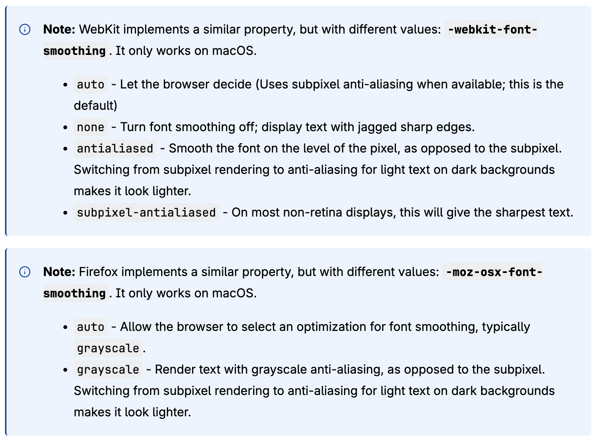{: width="750"}

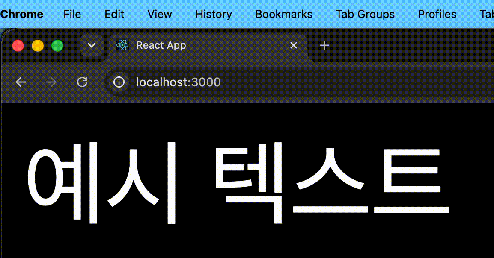{: width="550"}

그러나, `-moz-` 접두사는 Firefox을 위한 속성이므로 되도록 `-webkit-font-smoothing`만 사용하기 보다는 `-moz-osx-font-smoothing` 속성을 함께 포함해 주는 것이 올바른
사용 방법이 될 것 같다.

추가로, 두 속성을 함께 포함해 줌으로써 기기별 브라우저 호환 범위 측면에서도 가장 이점이 크다.

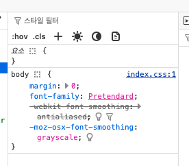{: width="300"}

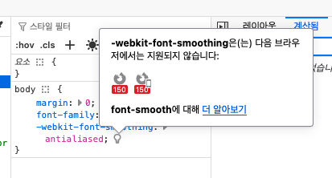{: width="350"}

<figcaption>-webkit-font-smoothing 속성만 적용했을 땐 Firefox 150 버전의 Desktop/Mobile 호환 불가</figcaption>

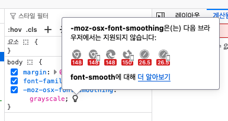{: width="350"}

<figcaption>-moz-osx-font-smoothing 속성만 적용했을 땐 Chrome 148 버전의 Desktop/Mobile, Edge 148 버전의 Desktop, Firefox 150 버전의 Mobile, Safari 26.5 버전의 Desktop/Mobile 호환 불가</figcaption>

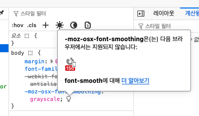{: width="350"}

<figcaption>-webkit-font-smoothing, -moz-osx-font-smoothing 두 속성을 모두 적용했을 땐 Firefox 150 버전의 Mobile 호환 불가</figcaption>

현재를 기준으로 해당 속성은 Non-standard 상태이므로 추후 사용 방법이 달라질 가능성이 있으니 사용에 유의해야 할 것 같다.

<br />

## 📝 마무리

이번 실험을 통해 다음과 결론을 얻을 수 있었다.

Windows는 다양한 하드웨어 환경에서 일관된 가독성을 제공하는 방향으로 발전해 왔으며, Apple은 자사 디바이스의 고해상도 디스플레이 환경에 맞추어 폰트 렌더링 방식을 변화시킨 것으로 보인다.

기업의 기술 적용 방식은 당연하겠지만 그 제품에 확실히 의존되는 것 같다. 그러나, 사용자마다 다양한 기기를 통해 제품을 경험할 수 있는 제품을 개발하고 있다면 일관된 사용자 경험을 제공하는 것도 반드시 고려해야 한다고 생각한다.

현재 조직의 제품 코드에서는 해당 속성을 초기 도입 시 다양한 환경별 폰트 차이들을 한 번에 보여드리기 어려워 모노레포의 일부 리액트 앱들에 한해 적용하는 것에서 그쳤지만, 이제는 본 게시글을 통해 전역 앱 속성으로써 포함시켜도 될 증좌를 만들게 된 것 같다.

<span class="highlight-text">**제품 엔지니어는 코드를 잘 작성하는 것에 더해 실제 사용자 시각에서 제품을 바라보고, 사고하는 과정이 개발 간에 포함돼야 제품의 가치를 진정 높일 수 있을 것이다.**</span>

<br />

## 참고

- [Web results font-smooth CSS property - MDN Web Docs](https://developer.mozilla.org/en-US/docs/Web/CSS/Reference/Properties/font-smooth#examples){:target="\_blank"}
- [Core Text](https://developer.apple.com/documentation/coretext/){:target="\_blank"}
- [How to Fix Blurry Fonts on macOS Mojave (With Subpixel Antialiasing)](https://www.howtogeek.com/358596/how-to-fix-blurry-fonts-on-macos-mojave-with-subpixel-antialiasing/){:target="\_blank"}
- [ClearType](https://learn.microsoft.com/en-us/dotnet/desktop/wpf/advanced/cleartype-overview){:target="\_blank"}
- [How to disable font smoothing / anti-aliasing in Windows 10](https://superuser.com/a/1812288){:target="\_blank"}
- [Add disable Anti-Aliasing for text](https://forum.figma.com/suggest-a-feature-11/add-disable-anti-aliasing-for-text-29525){:target="\_blank"}
- [Add feature to disable Anti-Aliasing entirely](https://forum.figma.com/suggest-a-feature-11/add-feature-to-disable-anti-aliasing-entirely-23696){:target="\_blank"}
