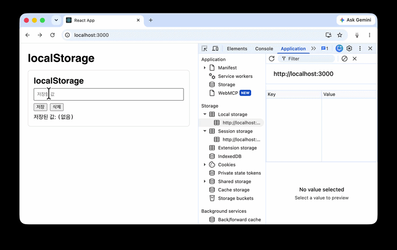
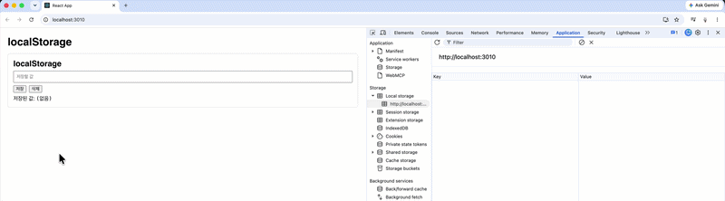
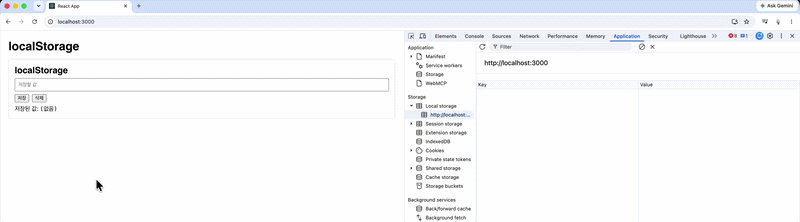
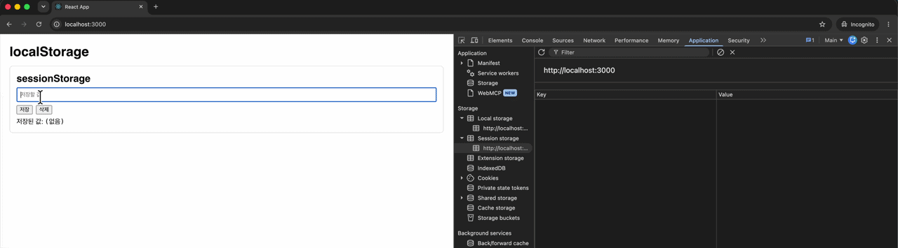
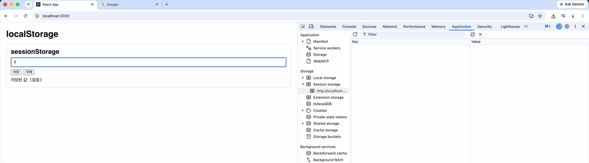
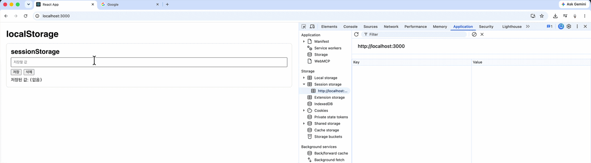

## 작성 배경

머릿속에만 두면 나중에 필요할 때 꼭 한 번씩 잊어버리는 문제가 있어서 나중에 쉽게 찾아보기 위해 글로써 기록해 두기로 했다. 요즘 같은 세상에 AI로 검색하면 수 초 내로 알 수 있는 내용이지만, 직접 사실 검증을 거치지 않으면 신뢰할 수 없고, 내 것이 되지 않는다는 생각이다.

 

## Web Storage API

[Web Storage API](https://developer.mozilla.org/en-US/docs/Web/API/Web_Storage_API){:target="\blank"}는 브라우저에 key-value 쌍을 저장하는 인터페이스다. 쿠키보다 직관적으로 값을 넣고 꺼낼 수 있으며, `window.localStorage`와 `window.sessionStorage`로 각각의 `Storage` 객체에 접근한다. 두 저장소는 origin마다 공간이 나뉘고, 서로 다른 객체를 쓰기 때문에 한쪽을 지워도 다른 쪽은 그대로다. 읽고 쓰는 동작은 동기적이라, 데이터가 많으면 그동안 다른 스크립트가 멈출 수 있다.

큰 데이터를 다루거나 메인 스레드를 막기 싫다면 IndexedDB처럼 비동기 저장소를 쓰는 편이 낫다.

 

## localStorage

같은 origin의 모든 탭에서 공유되며, 코드나 사용자가 직접 지우기 전까지 브라우저를 종료해도 데이터가 유지된다.

origin이란?
브라우저가 같은 사이트인지 판단하는 단위이다. 다음 세 가지가 모두 같을 때 같은 same-origin으로 판단한다.

1.  Protocol : http, https
2.  Host : [agetbase.com](https://agetbase.com){:target="\_blank"}, [www.agetbase.com](https://www.agetbase.com){:target="\_blank"}은 서로 다름
3.  Port : 443, 3000 서로 다른 origin

 

### 동작 확인

- `Normal Reload`, `Hard Reload`, `Reopen closed tab` 동작 시 데이터가 유지된다.

{: width="100%"}

- `Protocol` 또는 `Host`가 다를 시 데이터를 공유하지 않는다.

> `https://bunny-ch.dev-k8s.arkain.io/` URL은 127.0.0.1에 secure를 적용한 https 스킴을 사용하기 위해 `/etc/hosts`에서 매핑해 놓은 URL이다.

{: width="100%"}

- `Port`가 다를 시 데이터를 공유하지 않는다(3000, 3010은 다름).

  {: width="100%"}

### 제거 방법

- `localStorage.removeItem('keyName')`, `localStorage.clear()`
- 클라이언트의 브라우저 설정에서 사이트 정보 삭제(시크릿 탭 종료 포함)
- 개발자 도구의 `Application(Storage, Local storage)`에서 수동 제거

 

---

## sessionStorage

같은 origin이어도 탭마다 저장소가 분리되며, 해당 탭을 닫으면 데이터가 사라진다. origin 조건은 `localStorage`와 동일하다.

 

### 동작 확인

- 다른 탭일 때 데이터를 공유하지 않는다.

{: width="100%"}

- `Normal Reload`, `Hard Reload`, `Reopen closed tab` 동작 시 데이터가 유지된다.
  > 이 케이스는 예상과 달라서 기억에 남는다. session storage를 사용하는데 탭이 종료되었음에도 탭 복원 시 데이터가 보존된다.

{: width="100%"}

- 탭 종료 후, 페이지 재 진입 시 데이터가 유지되지 않는다.

{: width="100%"}

- `Protocol` 또는 `Host`가 다를 시 데이터를 공유하지 않는다.

- `Port`가 다를 시 데이터를 공유하지 않는다(3000, 3010은 다름).

### 제거 방법

- `sessionStorage.removeItem('keyName')`, `sessionStorage.clear()`
- 탭 닫기(시크릿 탭 종료 포함)
- 개발자 도구의 `Application(Storage, Session storage)`에서 수동 제거

 

## 차이점 정리

| 항목                                | localStorage                                         | sessionStorage                              |
| ----------------------------------- | ---------------------------------------------------- | ------------------------------------------- |
| 공유 범위                           | 같은 origin의 모든 탭에서 공유                       | 같은 origin이어도 탭마다 분리               |
| 새로고침 (`Normal` / `Hard Reload`) | 유지                                                 | 유지                                        |
| 탭 닫기                             | 유지                                                 | 삭제                                        |
| `Reopen closed tab`                 | 유지                                                 | 유지 (세션 복원)                            |
| 탭 종료 후 같은 URL로 재진입        | 유지                                                 | 삭제                                        |
| Protocol / Host / Port가 다를 때    | 공유하지 않음                                        | 공유하지 않음                               |
| 저장 용량                           | origin당 약 5MB                                      | origin당 약 5MB                             |
| 제거                                | `removeItem`, `clear`, 사이트 정보 삭제, 개발자 도구 | `removeItem`, `clear`, 탭 닫기, 개발자 도구 |

 

## 어떤 저장소를 선택할 것인가?

**데이터가 얼마나 오래 남아야 하는지**, 그리고 **다른 탭과 나눠도 되는지**에 있다. 이 두 축으로 보면 선택이 단순해진다.

탭을 닫아도, 브라우저를 다시 켜도 남아 있어야 하는 값은 `localStorage`가 맞다. 다크/라이트 테마, 온보딩 노출 여부처럼 사용자의 다음 방문에도 저장돼 있어야 하는 데이터가 있다. 같은 origin의 모든 탭이 같은 값을 읽기 때문에, 한 탭에서 테마를 바꾸면 다른 탭에도 반영된다.

`sessionStorage`는 일회성이라는 말만으로 고르기 어렵다. 새로고침에도 남을 필요가 없으면 변수에 두면 되고, 탭을 닫아도 필요하다면 `localStorage`다. `sessionStorage`가 남는 자리는 그 사이, 즉 실수로 새로고침해도 유지되지만 탭을 닫으면 폐기돼야 하는 값이다.

예를 들어 회원가입 2페이지까지 이름과 이메일을 적은 뒤 새로고침했다고 하자. 지금까지 쓴 내용이 전부 사라지면 다시 처음부터 적어야 한다. 그렇다고 그 값을 `localStorage`에 넣으면 탭을 닫은 뒤에도 이름과 이메일이 남는다. 다음에 같은 페이지에 들어왔을 때 폼이 채워져 있으면 편할 수는 있지만, 쓰지 않은 개인정보가 브라우저에 계속 남아 있는 셈이다. 같은 클라이언트 기기를 사용하면 이후에 다른 사람에게 이전에 입력했던 정보가 다시 노출될 수 있다는 것이다. 새로고침에는 남기고, 탭을 닫으면 지워야 할 때 `sessionStorage`를 사용하자.

`Reopen closed tab`에서 `sessionStorage`가 복원되는 점은 예외로 기억해 두는 것이 좋다. “탭을 닫으면 무조건 사라진다”고 단정하고 민감한 값을 넣으면, 사용자가 실수로 닫은 탭을 되살렸을 때 그 값이 다시 나타난다. 수명을 탭 단위로 가져가되, 복원 시나리오까지 포함한 수명인지를 한 번 더 고려해야 한다.

 

## 실전 팁

저장소는 origin 단위로 하나의 큰 key-value 공간이다. 키를 대충 정하면 서로 다른 화면이 같은 키를 덮어쓰게 된다.

예시로 DB에 저장된 글의 수정 초안을 `draft`라는 키 하나에만 저장하면, A글과 B글을 오갈 때 서로의 초안을 덮어쓰는 문제가 발생한다. `draft:${_id}`처럼 문서의 unique key를 붙이면 글마다 값을 분리하여 관리할 수 있다.

 

### 참고

- [Web Storage API](https://developer.mozilla.org/en-US/docs/Web/API/Web_Storage_API){:target="\blank"}
